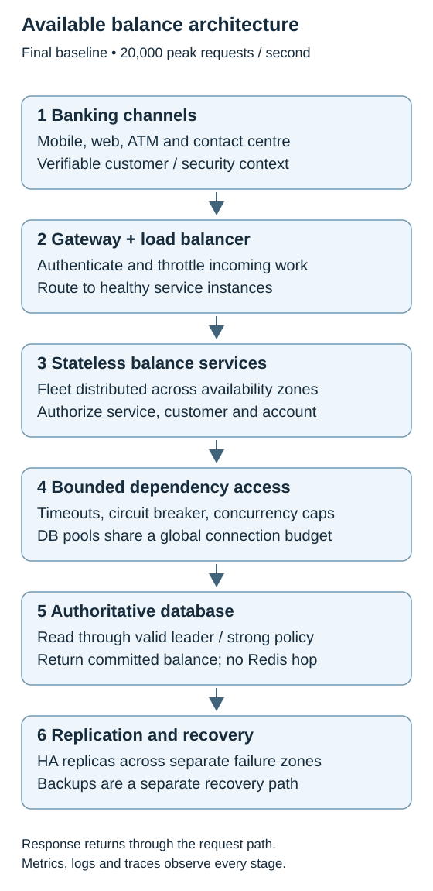
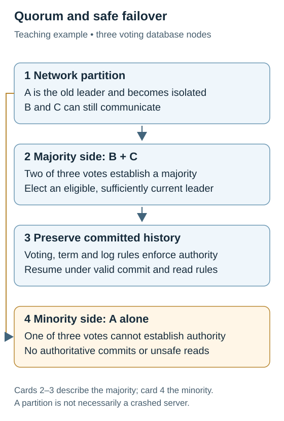
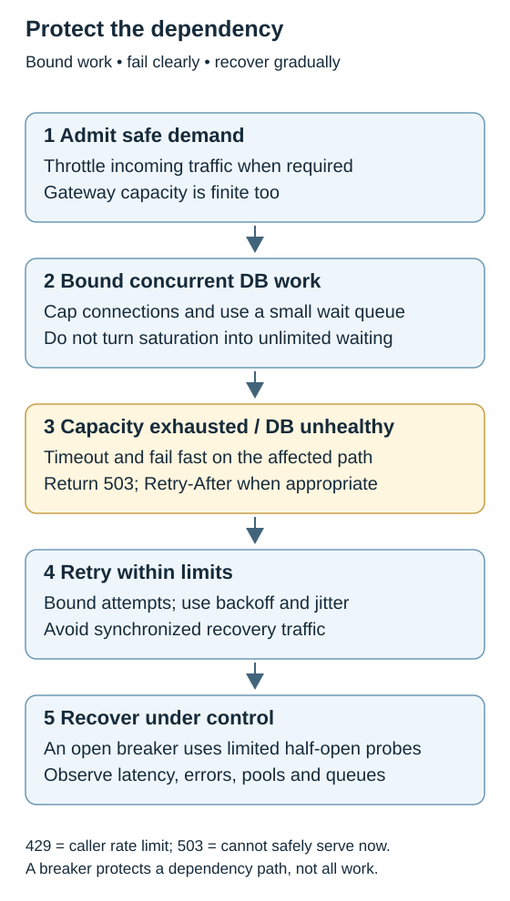

# Topic 1 — Architecture Foundations

[Back to Architecture Drills](../README.md)

**Status:** Complete

A bank's available-balance service is the vehicle for learning how correctness, scale, failure behavior, security, and delivery constrain one another. The final baseline is a stateless service fleet reading a strongly consistent authoritative database, protected by bounded work, explicit authorization, and safe database failover.

The design deliberately removes Redis from the critical balance-read path and postpones sharding until measurement justifies it. The harder topologies below record the drill's constraint mutations; they are not all mandatory components of the original 20,000 RPS design.

## Contents

- [Problem & Requirements](#problem--requirements)
- [Final Architecture](#final-architecture)
- [Component Responsibilities](#component-responsibilities)
- [Key Architecture Decisions](#key-architecture-decisions)
- [Data & Consistency](#data--consistency)
- [Scaling](#scaling)
- [Reliability & Failure Modes](#reliability--failure-modes)
- [Security](#security)
- [Observability](#observability)
- [Constraint Mutations](#constraint-mutations)
- [Adversarial Architecture Review](#adversarial-architecture-review)
- [AI Intersection](#ai-intersection)
- [TPM Delivery](#tpm-delivery)
- [Program Risks](#program-risks)
- [TPM Constraint Mutations](#tpm-constraint-mutations)
- [Concepts Learned](#concepts-learned)
- [Mental Models](#mental-models)

## Problem & Requirements

Return the customer's **current available balance** through mobile banking, web banking, ATMs, and contact-centre applications. The service must also become a reusable capability for other banking systems.

The defining example is a customer with $2,000 who spends $500 and immediately checks their balance. Once the debit succeeds, the next read must reflect the committed change: $1,500, assuming no further updates. A stale $2,000 can influence another spending decision. This is why consistency is a business requirement before it is a database setting.

| Requirement | Established in the drill | Architectural consequence |
|---|---|---|
| Customer population | 10 million customers; 500,000 daily active users | Customer count alone does not determine request load. |
| Peak throughput | 20,000 balance requests per second (RPS) | Size and test the entire request path, including connections and the database. |
| Latency | Under 200 ms; refined to 99% of balance requests under 200 ms | Monitor the successful request fraction under the threshold and p99 latency. |
| Availability | 99.99% | Multiple healthy service instances, separate failure domains, safe DB failover, and spare capacity. |
| Freshness | Strongly consistent available balance | Read through the authoritative path; no silently stale cache or ordinary asynchronous replica fallback. |
| Security | Caller identity plus account-level authorization | Authenticate at the edge and enforce permissions again at the balance service. |
| Financial correctness | No duplicate effects; preserve committed state and accounting rules | Transactional enforcement, durable operation records, and idempotency for balance-changing operations. |
| Failure response | Controlled temporary unavailability when correctness cannot be assured | Bound waiting and protect dependencies instead of returning a plausible but unsafe value. |

**Scope boundary.** The core capability is balance inquiry. Updates and transfers were introduced to test consistency, atomicity, retries, and sharding. The drill did not specify a full ledger schema, balance-calculation formula, payment-processing platform, or distributed-transaction implementation.

**Inputs still requiring production validation.** Average RPS, true concurrent demand, write volume/read-write ratio, record size, storage growth, gateway limits, and measured per-instance/database capacity were not established. The numerical exercises below are sizing examples, not benchmark results. No database product, exact production node count, commit policy, or disaster-recovery time/data-loss objective was selected.

## Final Architecture

[Open the scalable architecture diagram](assets/balance-architecture.svg)

**End-to-end read flow**

1. A channel requests the balance for an account with a verifiable customer/security context.
2. The gateway authenticates and applies admission controls; the load balancer distributes admitted work across healthy instances.
3. The balance service validates the calling service and the end customer's entitlement to the account. A trusted upstream is not an account-access bypass.
4. The service acquires bounded database capacity and reads using the authoritative strongly consistent path. Waiting, retries, and concurrency have limits.
5. The service returns the committed balance. If the authoritative path is unavailable or correctness is uncertain, it returns a controlled temporary-unavailable response.
6. Logs, traces, latency/error metrics, and dependency signals make both success and failure diagnosable.

**Supporting capabilities.** Identity, certificates, secrets, observability, and deployment controls support the request path. A connection proxy/pooler is an option when useful, not a mandatory extra hop. Redis is optional for suitable non-critical metadata. AI analysis runs separately and asynchronously. Shards appear only in the scale extension, with one authoritative owner per shard.

## Component Responsibilities

| Component | Responsibility | Why It Exists | Failure Impact |
|---|---|---|---|
| Channels | Present balance and controlled failure to the customer; carry trusted identity context | Multiple banking experiences share one capability | One channel can fail independently; channel checks alone cannot secure all callers. |
| Gateway / load balancer | Authentication integration, throttling, routing, health-based distribution | Protect and distribute entry traffic | A shared bottleneck or failed routing tier can affect the whole service. |
| Stateless balance service | Account authorization, authoritative reads, bounded dependency calls, operation semantics | Keeps customer access rules and behavior consistent across callers | Instances are replaceable; shared downstream failure still affects the fleet. |
| DB connection pools / optional proxy | Reuse connections within a shared connection budget | Prevent per-instance pools from multiplying beyond DB capacity | Pool exhaustion creates waiting even with healthy DB CPU. |
| Authoritative DB | Own balance state and enforce transactional constraints | Correctness must survive application races, retries, and restarts | Loss of authority means no safe balance response. |
| Replicas / failover mechanism | Replicate state and safely establish a replacement leader | Survive instance and permitted failure-domain loss | Lag, unsafe promotion, or lost quorum can block recovery or threaten committed history. |
| Backups | Recover stored state after broader loss | Replication and recovery solve different problems | Without tested recovery, a disaster may leave no dependable restoration path. |
| Identity / secrets / certificate management | Issue, validate, rotate and revoke identities and credentials | Enforce service identity and least privilege | Shared or unavailable security dependencies can have broad blast radius. |
| Observability / SRE | Detect customer impact, saturation, security events, and degraded redundancy | Production readiness requires evidence and response | Hidden degradation becomes a late customer-facing incident. |
| Optional Redis / async AI | Cache eligible metadata; analyze operational patterns | Introduce only with a demonstrated benefit | Neither may become necessary to answer an authoritative balance read. |

## Key Architecture Decisions

| Decision | Why We Chose It | Alternative | Trade-off |
|---|---|---|---|
| Define consistency before sync/async mechanisms | First establish what the customer may observe after a debit | Start with a transport or replication pattern | Requirements constrain implementation rather than follow it. |
| Keep services stateless | All instances use one authoritative data layer | Replicate local balances between app servers | Easier replacement and scaling; DB remains a shared dependency. |
| Remove Redis from available-balance reads | Invalidation failure can silently expose old funds | Cache balance and validate versions | More authoritative read load, less distributed correctness complexity. |
| Read through leader or supported strong-read policy | Ordinary asynchronous replicas may lag | Send all reads to read replicas | Lower read-scale freedom in return for the required visibility guarantee. |
| Optimize a single logical primary with HA first | 20,000 RPS alone does not prove a need to shard | Heavily sharded topology upfront | Simpler operation until measured limits justify migration. |
| Replicate across failure domains | A replica on the same failed zone is no rescue | More copies in one zone | Greater infrastructure cost and replication latency. |
| Use safe election and eligible promotion | A healthy replica is not automatically authorized or sufficiently current | Let any reachable replica take over | Some unavailability is preferable to conflicting authorities. |
| Bound work and fail fast | Slow dependencies otherwise retain threads, memory and connections | Unlimited queuing and aggressive retries | Some requests are rejected to prevent widespread collapse. |
| Enforce authorization at the service | Channels and internal callers can be compromised or misconfigured | Channel-only checks to save service work | Efficient checks cost some processing but preserve the security boundary. |
| Enforce idempotency at the transaction store | Concurrent service checks can both pass | Application-only check-then-insert | Requires durable records and transactional uniqueness. |
| Keep AI outside synchronous balance flow | No model is needed to retrieve a committed number | Add an LLM between service and DB | Operational recommendations remain possible without model latency or nondeterminism in reads. |

## Data & Consistency

### Ownership and the meaning of truth

The database/ledger is authoritative; app memory and caches are not independent sources of balance truth. A logical database can contain several physical instances. A **replica** copies an owner's state; a **shard** owns a different subset of state. Adding replicas and adding shards therefore solve different problems.

For the baseline, writes go to the valid leader and balance reads use the authoritative strong-read path. Reporting, statements, analytics, or eligible history reads can use lagging copies only when their own semantics permit. The drill did not make every banking read strongly consistent by default.

### Redis and the failed invalidation window

The initial Redis proposal aimed to reduce DB load and latency. The failure sequence changed the decision:

1. DB commits $2,000 → $1,500.
2. Redis invalidation or refresh fails.
3. Redis still contains $2,000.
4. A read can return incorrect available funds unless the system reliably detects the unsafe entry.

A version mismatch such as DB version 42 versus cache version 41 can reveal stale data. But consulting the DB on every cache hit largely defeats read offloading, and a version number alone does not prove freshness. The final decision was to optimize the authoritative path first.

Reintroduce a balance cache only after demonstrating both a real capacity/cost benefit and a correctness model that prevents stale reads. If cache correctness becomes uncertain, bypass the entry, read the authoritative store, and safely invalidate/refresh it. The fallback also needs capacity; removing trust in Redis cannot create unlimited safe DB throughput.

### ACID is not a distributed freshness guarantee

**ACID** expands to Atomicity, Consistency, Isolation, and Durability.

| Property | Question it answers | Drill example |
|---|---|---|
| Atomicity | Do all changes commit, or none? | Debit, credit and transaction record form one all-or-nothing transaction where a local boundary covers them. |
| Consistency | Are defined rules and invariants preserved? | Valid account and accounting constraints remain valid after the transaction. |
| Isolation | Can concurrent transactions interfere unsafely? | Two purchases must not both act on an incompatible view of the same funds. |
| Durability | Does committed state survive failure? | An acknowledged transfer must not disappear after restart. |
| Distributed strong consistency | What can a subsequent reader observe? | After the debit succeeds, a read must not return the older $2,000 copy. |

The useful mistake was assuming an ACID transaction prevented stale replica reads. It does not: the primary can commit correctly while an asynchronous replica remains behind. The transaction boundary and read-routing/replication policy must both satisfy the business guarantee. Isolation also needs an appropriate transaction design and level; the acronym alone is not proof that every race is prevented.

### Replication, acknowledgements and safe authority

- **Asynchronous replication:** the primary can finish before a replica catches up; this creates the stale-read window.
- **Synchronous acknowledgement:** the commit waits for the required replica acknowledgement(s), adding dependency latency and potentially reducing write availability.
- **Policy matters:** the exercise “leader + any 1 of 3 replicas” can tolerate one replica loss if another eligible replica satisfies the policy. Requiring all replicas, or one specific replica, behaves differently.
- **Election and commit policy are different decisions:** that acknowledgement example is not a universal quorum recipe or a selected production configuration. Acknowledgement durability, replica apply state, read rules, and failover eligibility must work together; synchronous replication alone does not make every replica read current.

**Quorum from the database upward.** One DB instance is one running database member with compute, memory, storage and connections. One leader plus two replicas is three instances. With three voting members a majority is two; with five it is three. These are teaching topologies, not a mandate to deploy five nodes.

Nodes exchange heartbeats. Loss of contact triggers suspicion and an election, not proof that the old leader is dead. Eligible candidates seek votes under the cluster's term/epoch and replicated-log rules. A majority establishes authority; stale authority must not continue committing conflicting writes. Clients then reach the valid leader. This logic belongs in the database/coordination system, commonly through consensus such as Raft, rather than custom balance-service voting.

Two majority sets overlap. That fact supports safety **together with** voting, term, log, and authority-enforcement rules; counting nodes alone is insufficient. An eligible replacement must preserve committed history, rather than arbitrarily promoting a replica that is five transactions behind.

In a five-node partition of three versus two, the majority can continue only while the required database policies are satisfied. The minority cannot safely claim authority. This is the drill's **CAP** trade-off: during a network partition, prefer consistency of money-critical state over serving every request. A likes counter can make a different choice because temporary disagreement has different consequences. CAP availability is not the same metric as the monthly 99.99% operational SLO.

### Timeouts, idempotency and transaction boundaries

A DB can commit an update and lose the response on the network. A timeout therefore means **unknown outcome**, not proven failure. Retrying as a new operation risks another debit or credit.

Use the same idempotency ID for the same logical operation and retain the result durably. Service checks can identify repeats early, but the authoritative store must enforce uniqueness and couple that enforcement with the transaction. Two requests can both observe “ID absent”; a separate check and insert is a race. A unique constraint with correct transactional enforcement ensures only one logical operation commits, and a duplicate obtains the recorded outcome.

**Atomicity protects one execution; idempotency protects repeated executions.** A unique ID by itself is not idempotency, and atomicity is broader than maintaining unique keys.

### Sharding and partial transfer recovery

When a measured single-owner limit is reached, partition by account/customer so different shard leaders own different account sets. One logical store now has multiple physical ownership and transaction boundaries.

A transfer across shards can debit Account A on Shard 1 and fail before crediting Account B on Shard 2. This is **cross-shard coordination**, not inherently split brain. Split brain means competing authorities for the **same** state.

Preserve durable transfer state: transfer ID, debit completion, credit pending, current status, and retry/compensation state. Recovery must know what remains and whether to resume or compensate. Each retried effect, including the pending credit, must be idempotent. Prevent duplicate effects, orphaned state, and permanently unbalanced completion. Saga, transactional outbox and distributed-transaction choices were identified for later study, not fully designed here.

## Scaling

### Capacity exercises that changed the reasoning

| Exercise | Result | What the number does and does not establish |
|---|---|---|
| 20,000 peak RPS ÷ 2,000 safe RPS per instance | 10 instances | Bare load minimum under the stated exercise assumption; no failure reserve. |
| Lose one of those 10 instances | 18,000 RPS remains | Autoscaling cannot instantly close the 2,000 RPS gap. |
| Survive two simultaneous instance failures at peak | At least 12 instances | Covers that specific failure assumption, not automatically an AZ loss, burst, or deployment overlap. |
| New instance takes 90 seconds; weekday demand doubles at 9:00 | Pre-scale before 9:00 with startup/health-check buffer | Predictable demand should not wait for reactive detection. |
| 20 instances × 50 DB connections | Up to 1,000 connections | Pools create downstream demand independently of request volume. |
| 100 instances × the same 50 connections | Up to 5,000 connections | A 5× connection increase can happen even at unchanged customer RPS. |
| DB budget 2,000 connections ÷ 100 instances | At most 20 per instance before reserve | Allocate less where admin, other services, failover and maintenance need capacity. |

The 12-instance example provides 20% extra capacity above the 10-instance requirement; that is not the same as 20% idle fraction of the provisioned fleet. Runtime headroom must cover expected short-term shocks. A five-year volume forecast informs the roadmap, not the immediate reserve needed before autoscaling reacts.

| Scaling Problem | Design Response | Remaining Trade-off |
|---|---|---|
| Service compute saturation | Horizontally scale stateless instances and distribute traffic | More instances multiply connection pools and downstream demand. |
| One DB leader becomes constrained | Optimize queries/indexes, compute, storage and connections first | Vertical scaling has a ceiling and adds no independent failure domain. |
| Genuine write/storage ownership limit | Shard after measurement | Routing, rebalancing, hot shards, cross-shard operations and harder recovery. |
| Gateway pressure | Verify throughput, TLS termination, connection and rate-limit capacity | A gateway is not inherently unlimited. |
| Hot app instance | Inspect sticky sessions, load-balancer distribution and account affinity | Keep application placement separate from data ownership. |
| Hot database shard | Rebalance/split ranges, isolate hot accounts, revisit partition key | A single hot account's state cannot necessarily be divided freely; migration is real work. |
| Sudden or short-lived bursts | Headroom, admission limits and pre-scaling where predictable | Reactive scaling can arrive after the spike. |
| DB pools fill | Global connection budget, smaller pools, optional proxy, concurrency bounds | Reject or briefly queue excess work instead of manufacturing capacity. |

## Reliability & Failure Modes

The dangerous cascade is **slow DB → occupied connections → queue growth → timeouts → retries → more DB pressure**. A dependency can be healthy at the process level while its network path is unreliable or its callers are blocked waiting for capacity.

| Failure | System Behaviour | Detection | Recovery / Mitigation |
|---|---|---|---|
| Service instance crashes | Healthy peers carry admitted traffic | Health checks, errors, per-instance load | Remove unhealthy target; reserve absorbs loss; autoscaling restores capacity. |
| DB takes 5–10 seconds | Waiting can spread upstream and exhaust shared resources | Dependency latency, pool wait, p99, queues | Timeouts, breaker, concurrency bounds and controlled retries. |
| DB pool exhausted | Requests wait before query execution | Pool utilization/wait time, queue depth | Brief bounded wait; shed excess; respect global DB budget. |
| Intermittent network fault | Some calls succeed; others hang/reset; write outcome may be unknown | Connection failures, traces, timeouts | Bound retries; resolve write outcomes through durable IDs. |
| Retry storm | New retries overlap still-running work | Retry volume, rising latency and dependency demand | Bounded retries, exponential backoff, jitter, admission limits. |
| Leader fails | Temporary disruption until valid authority exists | Heartbeats, election/leader-change signals | Elect eligible replacement, preserve committed state, redirect clients. |
| Replica slow or lost | Impact depends on required acknowledgement policy | Replication lag and commit latency | Use policy-compatible healthy replicas; stop when guarantees cannot be met. |
| Network partition | Majority may continue; minority cannot claim write authority | Lost peer connectivity/quorum | Consensus and authority enforcement; never improvise competing leaders. |
| Entire authoritative layer unavailable | No safe available-balance read | End-to-end errors, dependency failure | Controlled temporary unavailability; restore/fail over only to a valid authority. |
| AZ lost | Traffic moves to surviving zones; system is degraded | Zone health, quorum, survivor utilization | Replication must already exist; verify surviving capacity and alert on lost redundancy. |
| Cache invalidation fails in an extension | Cached balance becomes unsafe | Correctness/version signals where reliably available | Bypass suspect cache; use authoritative store within its capacity. |
| Cross-shard debit completes; credit fails | Transfer is partially complete | Durable workflow status, pending work | Resume or compensate from durable state; every effect idempotent. |
| Unauthorized internal calls | Deny affected operations | Authorization denials, correlated security signals | Investigate, contain narrowly, revoke/rotate if needed; preserve safe functions. |

**Circuit breaker scope.** Closed permits normal calls; open fails fast on the protected dependency path; half-open permits a small number of probes. An open balance-DB breaker does not automatically stop unrelated server operations. Heartbeats and leases help liveness/ownership; they do not replace timeout, breaker and concurrency controls for a slow synchronous dependency.

**HTTP response distinctions.** 404 means not found. 429 means caller/traffic-class rate limiting. 503 means the service cannot safely process the request now, including partial overload or dependency failure; the whole service need not be down. A `Retry-After` hint can guide retry timing, but callers still need bounded backoff and jitter to avoid waking together.

**Failover is a capacity event.** Losing a zone containing 40% of service capacity while survivors are already heavily utilized can cause a secondary overload even when routing works. Replica count, quorum and survivor headroom must all survive the intended failure. Backups support recovery; they are not immediate failover capacity.

## Security

### Identity must survive every important boundary

| Boundary / concern | Required reasoning from the drill |
|---|---|
| Customer device → bank edge | Authenticate the customer; reject bad traffic early; encrypt the connection. |
| Gateway/internal service → balance service | Authenticate the calling service and carry verifiable customer context. Do not accept “trust me, this is Customer 123.” |
| Customer → requested account | Check the authenticated customer's actual entitlement to Account 456, not just membership in the bank. |
| Balance service → DB | Use a distinct service identity with only the required database permissions and protected transport. |
| Internal network | Network location alone grants no trust. Compromised workloads and stolen credentials can originate internally. |

The initial proposal put checks in the channel to avoid loading the balance service. It was rejected because new, compromised, or misconfigured callers could bypass them. The performance task is to make service-side authorization efficient, not remove it.

**Authentication** proves who is calling. **Authorization** decides what that identity may do to a particular resource. Service identity and customer identity are both needed for delegated customer requests. Stable customer/party ID, account ID, scopes/roles and channel identity are useful context; customer names and masked PINs are not reliable account-authorization evidence.

### Transport, permissions and credential lifecycle

- **TLS — Transport Layer Security:** encrypts transport and normally authenticates the server to the client.
- **mTLS — mutual TLS:** authenticates both connection endpoints. It proves service identity; it does not establish that the end customer may read every account.
- **OAuth 2.0 / access tokens:** carry verifiable delegated context and permissions, subject to token validation and resource authorization. Read scope does not permit update scope.
- **Token compromise:** expiry limits useful lifetime; revocation/invalidation ends access when required. Restrict audience/scopes, protect refresh tokens, and detect suspicious use. Short lifetime reduces exposure; it does not prevent theft.
- **Least privilege:** each user/service gets the minimum permissions for its job. Shared all-service DB credentials destroy attribution, widen compromise, and make selective revocation difficult.
- **Secrets and certificates:** centrally manage issuance, protected storage, automatic rotation, revocation, and distribution without downtime. KMS (Key Management Service) manages cryptographic keys; secrets management and PKI (Public Key Infrastructure) cover broader credential/certificate needs.
- **At rest:** protect DB storage, logs, backups and snapshots with encryption, controlled access and key management. Encryption does not stop an over-privileged authorized caller from reading, exporting or manipulating decrypted data.

### Containment without failing open

If an authenticated Service A repeatedly attempts an unauthorized balance update: **reject → detect → investigate → contain → recover**. Correlate request patterns and traces; assess workload/credential compromise; revoke or rotate as necessary.

If A is business-critical, block the unsafe capability while preserving genuinely authorized operations where containment is trustworthy. The drill initially called this “partial fail open”; the corrected term is **selective containment / graceful degradation**. Failing open means letting access through when a security control fails and is not the intended behavior.

## Observability

| Signal | What it reveals | Decision it supports |
|---|---|---|
| p50, p95, p99 and fraction under 200 ms | Typical experience and tail delay | Detect contention/dependency trouble hidden by averages; assess latency SLO. |
| Availability, error rate, timeouts, 5xx | Customer-visible service outcome | Incident response and release risk. |
| CPU, memory, in-flight work, per-instance utilization | Application resource pressure and skew | Scale compute only when compute is the constraint. |
| Pool utilization/wait, queue depth | Waiting before the DB can execute | Bound concurrency, adjust pools, shed work. |
| DB query/commit latency, throughput, locks, I/O | State-layer bottlenecks | Optimize queries/storage or revisit ownership distribution. |
| Retry volume, breaker state | Amplification and dependency health | Stop harmful retries; control recovery probes. |
| Replication lag, quorum, leader changes, AZ headroom | Safety and degraded redundancy | Validate failover readiness before the next fault. |
| Authorization failures and service identity in audit logs | Unauthorized access and compromised callers | Investigation and selective containment. |
| Correlated logs and end-to-end traces | Where time/failure entered the request path | Separate gateway, service, network and DB causes. |
| Error-budget consumption | Reliability tolerance already used | Slow/defer rollout or prioritize repair. |

Healthy CPU/RAM does not establish health. If p99 doubles, inspect DB/network latency, connection waits, retries, lock contention and slow subsets before adding instances. If app utilization is 40% but DB pools are full, scaling the app may make the actual bottleneck worse.

**SLI / SLO / SLA.** A Service Level Indicator measures reality; a Service Level Objective sets a target against that indicator; a Service Level Agreement defines contractual commitments/remedies. Missing an internal SLO does not automatically trigger an SLA penalty.

**Error budget.** A 99.99% availability target permits 0.01% unavailability under the defined measurement method/window. For a time-based 30-day month, that is **4.32 minutes**. The drill's example of 20 minutes unavailable has therefore already exceeded that monthly budget; it is not an example with remaining time. Request-based budgets use eligible requests instead of downtime minutes, so the operational definition must be explicit.

At **90% of the monthly budget consumed halfway through the month**, defer or tightly constrain non-essential major rollouts, focus on the failure modes consuming the budget, and define evidence for resuming normal change velocity. Reliability fixes may still warrant rollout. A new reporting window alone does not repair an unstable system.

## Constraint Mutations

These mutations test limits of the existing architecture rather than replace it wholesale.

| Original Constraint | New Constraint | What Broke | Architecture Change | New Trade-off |
|---|---|---|---|---|
| 20,000 peak RPS | 200,000 RPS for 30 minutes | Gateway/service capacity, then pools/DB may saturate | Verify gateway; scale stateless fleet; cap DB concurrency; shed beyond safe capacity | Throttling protects the system but does not serve all legitimate demand. |
| Existing fleet size | 10× more service instances | Connection pools multiply | Global budget, smaller per-instance pools, optional proxy | Application scaling remains bounded by state-layer capacity. |
| Healthy multi-AZ topology | One AZ and DB replica lost | Capacity and voting members disappear | Route to healthy zones; existing replication and safe election | Must alert on degraded redundancy even if users see no failure. |
| Adequate normal capacity | Lost zone contained 40%; survivors already at 70% | Successful routing can overload survivors | Maintain failure-state headroom and control admitted demand | Redundancy without spare capacity is insufficient. |
| 99.99% SLO | 30% cost reduction; remove an AZ proposed | Required failure tolerance may disappear | Cut waste/oversizing first; prove quorum and survivor capacity before reducing redundancy | Savings cannot silently weaken the unchanged SLO. |
| Unconstrained geography | Canadian state stays in Canada; US state stays in US | Cross-border placement and failover options invalid | Constrain processing, replicas, backups and relevant derived data | Residency reduces recovery choices. |
| Canadian regional availability | Canadian region lost; US failover forbidden | No permitted cross-border recovery path | Use permitted in-country resilience; become unavailable if no valid path exists | Compliance takes priority over serving from prohibited geography. |
| Normal Canadian demand | Traffic doubles with one AZ in maintenance | Remaining DB/network/compute/connection capacity may be insufficient | Check capacity and quorum before redirecting/admitting demand | Must plan compound events, not isolated ones. |
| Survivors can carry load | Only at 95% utilization | Almost no room for another shock | Pre-scale or shed non-critical load | Extra capacity costs money but supports recovery. |
| Normal DB latency | Latency rises; CPU/RAM normal | Waiting may be outside compute | Inspect pool waits, locks, I/O, network, slow queries | Avoid scaling the wrong resource. |
| Finite pools | Pools full; queues grow | Unbounded work drives memory and latency failure | Bound queue/concurrency and apply backpressure | More controlled 503s may be necessary. |
| Load shedding active | 503 rate spikes | Unsure whether protection or under-provisioning | Correlate app load, pools, queues, DB and autoscaling ceiling | Response code alone does not locate the bottleneck. |
| Healthy fleet totals | One service instance hot | Sticky/affinity/routing skew | Even stateless distribution; separate account ownership from app placement | Fleet average hides localized overload. |
| Even app routing | One DB shard hot | Customer/range workload skew | Split/rebalance/isolate; change key if justified | Resharding is a migration, not a free scaling switch. |
| Local transaction boundary | Transfer crosses two shards | Debit and credit can complete separately | Durable transfer state, recovery/compensation, idempotent effects | Distributed completion has greater operational complexity. |
| Debit committed | Credit shard unavailable, later retried | Duplicate credit or orphaned transfer risk | Resume/compensate from durable status with same logical identity | Idempotency alone cannot tell which step remains. |

Additional foundation exercises tested predictable 9:00 AM bursts, 90-second startup, two-instance failure reserve, asynchronous replica staleness, synchronous replica loss, and network partitions. Their calculations and policies are preserved above.

## Adversarial Architecture Review

| Challenge | Initial Thinking | Final Reasoning | Principle Learned |
|---|---|---|---|
| Where should state live? | Cross-server replication between balance instances | Keep app instances stateless; persist authoritative state centrally/logically | Replicate state in the owning layer. |
| What should own balances? | Redis | Durable transactional balance/ledger store | A fast copy is not automatically financial authority. |
| Could versions rescue the cache? | Compare cache version with DB each time | Adds DB work and still needs a sound freshness protocol | An optimization must preserve correctness and retain measurable benefit. |
| Can every read use replicas? | Separate write primary from many read replicas | Asynchronous lag violates the available-balance promise | Read scaling is constrained by semantics. |
| What is over-engineered at 20,000 RPS? | Scaling DB instances aggressively | Start with a logical primary and HA; measure before sharding | Do not pay distributed complexity before the workload needs it. |
| What assumption needs testing? | Concurrent/peak capacity and latency | Prove full-path p95/p99, pools, bursts, autoscaling and failover | Capacity arithmetic is not production evidence. |
| Biggest remaining SPOF? | Hot accounts on one shard | Hot shard is a concentrated bottleneck; leader without failover, shared edge/network/security dependency or region can be broader SPOFs | Performance concentration and single points of failure differ. |
| What would simplify the baseline? | Remove caching | Remove Redis from critical reads when DB can meet the target | Simplification can improve correctness and operability. |
| How keep latency low without Redis? | More leader/replica coordination | First optimize queries, indexes, pools, network and capacity | More coordination can add latency. |
| When add Redis back? | Invalidate/update within 200 ms | Demonstrated need plus safe correctness under invalidation failure | Fast normal operation is insufficient evidence. |
| Does autoscaling fix DB pressure? | Add instances | Each instance adds pools; control global concurrency | Scale callers in the context of dependency limits. |
| Does ACID imply fresh replica reads? | No stale reads should be possible | Primary transaction can be ACID while another copy lags | Transaction correctness and distributed visibility differ. |
| Does a DB commit resolve a timeout? | The commit tells us success | The caller may never receive that response | Unknown outcomes require durable identity and reconciliation. |
| Does idempotency solve a stuck transfer? | Idempotency alone | Also persist progress and recovery state | Duplicate prevention and workflow recovery are separate. |
| Is channel authorization enough? | Avoid repeated checks to reduce load | Service enforces account entitlement for every supported caller | Security must hold at the resource boundary. |
| Is a maintenance window enough for AI resharding? | Execute in a safe window | Also validate, simulate, approve, back up and define abort/rollback controls | Timing is only one execution safeguard. |

## AI Intersection

| Question | Conclusion |
|---|---|
| Where could AI add value? | Analyze customer/account traffic distribution, hot shards, utilization skew, growth and seasonal peaks; recommend partitioning/rebalancing. |
| Should AI actually be used? | Optional operational assistance; no compelling role in calculating or retrieving the authoritative balance. |
| Placement | Asynchronous/offline: metrics/events → analytics → AI analysis → recommendation → engineering review. |
| Why exclude synchronous inference? | Extra latency, dependency failure, inference cost and nondeterminism add no value to an exact committed-number lookup. |
| AI failure modes | Incorrect capacity/shard recommendation or unsafe data movement if advice is treated as authority; model failure must not interrupt balance reads. |
| Cost implications | Inference adds cost; no model, token budget or spend estimate was selected. Keep analysis separate from per-read request volume. |
| Security implications | Financial-data movement must not be autonomously authorized by model output. Access/privacy design for an actual analysis pipeline remains to be specified. |
| Deterministic fallback | Balance service continues its conventional path; engineers use observed metrics and deterministic checks if AI is unavailable or untrusted. |

**The resharding challenge.** If AI predicts a hot partition next week, execution requires engineer approval, deterministic shard-map validation, capacity simulation/impact analysis, backup and rollback plans, replication-health checks, a maintenance window or controlled online migration, observability, and automatic abort thresholds for latency/error degradation. These were the agreed controls; no numeric abort threshold or AI implementation was invented.

## TPM Delivery

The Technical Program Manager (TPM) translates this architecture into dependencies, integration evidence and accountable launch decisions.

| Workstream | Dependencies | Parallelizable? | Major Deliverable |
|---|---|---|---|
| API / Platform | Interface and identity model; downstream capacity assumptions | Yes, with service/security design | Gateway, routing, throttling, authentication integration, service exposure. |
| Balance Service | API contract, authoritative access patterns, security policies | Yes; partial environments/mocks unblock work | Read behavior, authorization, idempotency where needed, backpressure and failure handling. |
| Database / Platform | Data/consistency requirements and technology/topology decisions | Design can start early alongside others | Schema/indexes, HA/replication/failover, access, connection budget and performance baseline. |
| Security | Caller/resource model; deployment and data boundaries | Yes, early; can become launch-critical | Token model, mTLS, authorization, secrets/certificates, least privilege, validation. |
| SRE / Observability | Enough API/service/security shape to identify signals | Design/instrument during build | SLIs/SLOs, dashboards, alerts, traces, capacity signals, runbooks. |
| QA / Integration | Contracts early; functioning components for full validation | Planning/component work early | Functional, end-to-end, load, resilience, failover and security evidence. |
| Implementation / Release | Environments, tested integration, operational and security readiness | Plan early; execution gated | Deployment sequence, rollout/rollback readiness, final Go/No-Go. |

### Sequence and critical path

**Data/consistency requirements → DB choice and HA topology → schema/access patterns → usable data-layer milestone → end-to-end integration → performance/resilience/security evidence → production readiness.**

API, service, DB/platform and security design can proceed in parallel once interfaces and responsibility boundaries are sufficiently clear. The user's observability sequencing clarification was accepted: begin design/instrumentation during the build, once the system has enough shape, rather than waiting for finished implementation.

DB/platform is the likely primary technical critical path because the full request path cannot be proven without the authoritative store. Security can be a parallel launch gate. A critical path is established by dependency impact, not by calling one team important; there was no fully dated schedule from which to calculate it mechanically.

### Milestones and evidence

1. **Data layer ready for integration:** schema/tables and mappings validated, representative component tests, required indexes, connectivity, permissions, working HA/replication and basic performance. “Schema exists” alone is insufficient.
2. **End-to-end integration:** channel → gateway → balance service → DB → response; include authorization, timeouts, DB failures, retries, backpressure and observability.
3. **Production-like load:** expected peak/burst concurrency, p95/p99, DB pool behavior and autoscaling responsiveness.
4. **Resilience and security:** kill instances, lose an AZ, force leader failover, simulate slow dependencies/network faults; validate token misuse, mTLS and account authorization.
5. **Rollback and production readiness:** prove failed release/migration reversal does not corrupt state; complete monitoring, alerts, runbooks and support readiness.
6. **Go/No-Go:** signed test/review evidence, security approval, mandatory operational requirements, validated rollback/failover and accountable disposition of unresolved risks.

**Rollout/migration boundary.** The drill established release ownership, deployment sequencing and rollback validation. It did not select a canary percentage, a legacy cutover method or a detailed data migration. Resharding controls were discussed conditionally; they are not a launch dependency for the baseline.

### Executive communication

State the current condition, quantify the exposure, connect it to customer/business consequences and recommend a decision. For 90% error-budget consumption halfway through the month: highlight the small remaining tolerance, increased SLO risk from a major rollout, possible contractual consequences only if SLA thresholds are crossed, and the recommendation to defer non-essential change or tightly constrain scope with accountable risk ownership.

## Program Risks

| Risk | Impact | Early Signal | Mitigation | Contingency |
|---|---|---|---|---|
| DB/platform readiness slip | Blocks genuine integration and failover/performance proof | Schema/connectivity/topology milestone delay | Resolve dependencies early and baseline performance | Mocks/partial environment for independent work; escalate residual scope/date/resource trade-off. |
| Security arrives late | Launch-critical authorization or certificate issue | Unresolved policy model; repeated security-test failures | Parallel security work and early trust-boundary decisions | Verified compensating control or launch escalation. |
| Capacity assumptions unproven | Peak or failover outage | Tail latency/pool pressure under realistic load | Full-path load and failure tests | Pre-scale, bound demand, revise capacity before launch. |
| Over-sharding / unnecessary cache | Extra delivery dependencies and correctness failure modes | Complexity grows before a measured bottleneck | Optimize simple authoritative baseline | Defer unnecessary components. |
| Observability delayed | Integration failures hard to diagnose; weak operations | Missing traces, SLIs, queue/pool metrics | Start once architecture has enough definition | Readiness gate prevents unobservable launch. |
| Retry / connection amplification | Scaling action triggers DB outage | Pools/connections/retries rise with fleet growth | Global budgets and bounded work | Shed traffic and restore dependency health. |
| Cost cuts remove failure capacity | Availability promise unsupported | Proposed AZ removal; high survivor utilization | Validate quorum and headroom in failure state | Retain required redundancy; seek savings elsewhere. |
| Residency constrains recovery | Otherwise viable failover is impermissible | Cross-border replica/backup/processing dependency | Design geography constraints into topology | Controlled unavailability when no permitted recovery exists. |
| Error budget nearly exhausted | Major release increases reliability exposure | 90% consumption halfway through window | Prioritize causes, reduce non-essential change | Leadership decision on bounded scope and residual risk. |
| Unproven rollback / recovery | Failed release or transfer leaves unsafe state | Happy-path tests pass but recovery evidence absent | Test rollback/failover and durable recovery behavior | Stop release or recover through validated procedures. |

## TPM Constraint Mutations

### Database/platform slips three weeks; launch date fixed

The initial answer correctly began with investigation and blocker removal. The refinement was to quantify downstream critical-path impact **before** assuming three weeks of launch delay or adding people.

**Find root cause → identify blocked downstream work → calculate critical-path impact → clear blockers/reallocate capacity → parallelize independent work → escalate unresolved trade-offs.**

Distinguish dependency, scope, underestimated complexity, environment and staffing causes. API/service work may continue against agreed mocks or a partial environment. That reduces idle time but cannot replace final integration and resilience proof. Additional staffing only helps when the work and onboarding allow it. If recovery is insufficient, make scope/date/resource options and their risks explicit to accountable leadership.

### Serious authorization flaw one week before a fixed regulatory launch

The proper fix takes two weeks. The initial proposal was vulnerability assessment followed by SME/head exception approvals, with postponement for a non-regulatory release. The correction is that a regulatory deadline does not make an unacceptable authorization risk acceptable.

1. Assess exploitability, affected operations, customer impact and residual risk with Security.
2. Determine whether a **safe compensating control actually removes the exploit path** for the release. Examples discussed were disabling the affected operation, restricting access, or an additional authorization check. Each must be validated against the actual flaw; the label “compensating control” is not evidence of safety.
3. If acceptable safety is demonstrated, obtain explicit Security, Architecture, Risk/Compliance and accountable business approval for a time-bounded exception with a committed permanent-fix date.
4. If no control makes launch acceptably safe, escalate the conflict. Do not treat a critical defect as a routine waiver.

**Escalate to whom?** Security leadership/CISO organization, Risk & Compliance, the business/product executive owning the regulatory commitment, and the technology/engineering executive owning the platform. Use the formal Go/No-Go or risk-acceptance forum when appropriate.

**What must the TPM bring?** The vulnerability, customer/regulatory impact, feasible controls, residual risk, permanent-fix timing and consequence of delay. Accountable owners must resolve the launch decision. For a non-regulatory release, postponement was the preferred response rather than accepting unnecessary risk.

## Concepts Learned

| Concept | Meaning | Why It Matters | Example From This Architecture |
|---|---|---|---|
| Functional requirement | What the system must do | Defines capability | Return current available balance across channels. |
| Non-functional requirement | Required quality/constraint | Drives topology and trade-offs | 20,000 RPS, under 200 ms, 99.99%, strong reads. |
| RPS / concurrency | Requests per second / simultaneous work | Population is not demand; rate is not in-flight count | Ten million customers did not size the fleet by itself. |
| Source of truth | Authoritative state owner | Resolves which copy governs correctness | Transactional balance/ledger store. |
| Stateless service | Does not own independent durable customer state | Enables replacement and even routing | Every instance reads the authoritative layer. |
| Load balancer (LB) | Routes across healthy targets | Distributes load and removes failed instances | Avoid one server carrying all traffic. |
| Horizontal / vertical scaling | More instances / larger instance | Capacity and failure-domain effects differ | App scale-out versus larger DB leader. |
| Headroom | Spare capacity for defined shocks | Autoscaling is delayed | Twelve instances to tolerate two losses in the exercise. |
| Pre-scaling | Capacity ready before expected load | Handles predictable peaks | Provision ahead of the 9:00 burst and 90-second startup. |
| DB instance / node | Running member of a database system | Makes topology concrete | One leader plus two replicas equals three instances. |
| Replica / shard | Copy of state / separate owned subset | Availability and write distribution are different | Replicas do not distribute one leader's write ownership. |
| Replication lag | Delay propagating/applying changes | Creates stale reads | Replica shows $2,000 after primary reaches $1,500. |
| Strong / eventual consistency | Immediate required visibility / convergence after delay | Select by business semantics | Available balance versus a likes counter. |
| ACID | Atomicity, Consistency, Isolation, Durability | Transaction guarantees need separate reasoning | All-or-nothing transfer with preserved rules and committed state. |
| Atomicity / idempotency | One execution all-or-nothing / repeats add no effect | Neither substitutes for the other | Transfer commits once despite retry. |
| Race / unique constraint | Concurrent check-then-act gap / authoritative uniqueness rule | App timing cannot enforce financial correctness | Simultaneous duplicate IDs cannot both commit. |
| Ambiguous outcome | Caller does not know whether work committed | Blind retry can duplicate effects | DB commit succeeds but response is lost. |
| Durable workflow state | Persisted progress and recovery status | Enables safe resume/compensation | Debit done, credit pending, same transfer ID. |
| Acknowledgement policy | Required confirmations for commit | Determines replica-loss behavior | Any-one versus all-replica requirement. |
| Quorum / consensus | Required agreement / protocol establishing consistent decisions | Prevents isolated authority under correct rules | Two of three votes; eligible leader election. |
| Split brain | Competing authorities for the same state | Can create conflicting balances | Two nodes independently accept account updates. |
| Network partition | Nodes cannot communicate despite possibly being alive | Failure suspicion is not proof of death | Majority and minority groups form. |
| CAP | Consistency, Availability, Partition tolerance | Partition forces a visibility/response trade-off | Money-critical minority rejects unsafe operations. |
| AZ / failure domain | Availability Zone / shared scope of failure | Copies must survive independent faults | Cross-zone replicas and survivor capacity. |
| HA / SPOF | High Availability / Single Point of Failure | Redundancy must cover the actual dependency | One unprotected authoritative DB can stop all reads. |
| Connection amplification | Fleet growth multiplies DB pools | App scale-out can destabilize DB | 20×50 connections grows to 100×50. |
| Bounded queue / backpressure | Limited waiting / upstream flow response | Prevents unlimited memory and latency growth | Queue briefly, then reject when DB capacity is full. |
| Throttling | Admission rate/policy control | Protects system before work enters | Gateway rejects over-limit traffic. |
| Timeout / circuit breaker | Limit wait / stop calls to unhealthy path | Contains slow dependency damage | Open breaker fails fast; half-open probes recovery. |
| Retry storm / backoff / jitter | Amplification / increasing delay / randomized timing | Recovery must not recreate overload | Thousands of clients avoid synchronized retries. |
| 429 / 503 / Retry-After | Rate limited / temporarily unable / retry timing hint | Communicates why work was rejected | DB saturation produces controlled 503s. |
| Tail latency | Slow end of request distribution | Averages hide customer pain | p99 rises despite healthy CPU. |
| SLI / SLO / SLA | Indicator / objective / agreement | Measurement, target and contract differ | Actual latency versus 200 ms target versus remedies. |
| Error budget | Tolerable unreliability under the SLO | Connects reliability to delivery | Reduce risky releases at 90% consumed. |
| Authentication / authorization | Identity / permitted action and resource | Logged-in users do not own every account | Customer 123 must be entitled to Account 456. |
| TLS / mTLS | Transport security / mutual endpoint authentication | Protects transport and service identity | Trusted connection still requires account checks. |
| OAuth / scope | Delegated access framework / permission extent | Limits actions on behalf of a user/service | Balance-read permission cannot authorize updates. |
| Least privilege / zero trust | Minimum permissions / no implicit network trust | Reduces compromise blast radius | Separate service credentials and explicit policy. |
| KMS / PKI | Key Management Service / Public Key Infrastructure | Keys, secrets and certificates need lifecycle controls | Safe issuance, rotation and revocation. |
| Graceful degradation | Preserve safe capability during partial failure | Continuity must not bypass security | Deny unsafe update while permitted reads continue. |
| Data residency | Constraints on geography of data/processing | Limits failover and backup choices | Canadian data cannot fail over to prohibited US placement. |
| Critical path | Dependencies whose delay moves completion | Directs delivery recovery | DB readiness gates meaningful end-to-end validation. |
| Compensating control | Alternative control addressing the actual exploit path | Supports a bounded exception only with evidence | Disable affected operation pending permanent fix. |

## Mental Models

- Requirements first: decide what the customer may observe before choosing sync/async mechanisms.
- A cache is a copy of truth; speed does not make it authority.
- Scale stateless compute freely only within the stateful dependency's limits.
- Replication copies ownership; sharding divides ownership.
- Atomicity protects one execution; idempotency protects repeated executions.
- Durable state says what remains; idempotency makes repetition safe.
- A timeout means uncertainty, not proof that nothing happened.
- Healthy CPU does not mean healthy service; waiting often happens elsewhere.
- Bound work before overload becomes unbounded waiting.
- Backpressure protects the dependency; backoff and jitter protect recovery.
- Headroom absorbs a failure now; autoscaling restores capacity later.
- Failover needs valid authority, current committed state, and enough surviving capacity.
- A hot shard is a distribution problem; a SPOF is a failure-dependency problem.
- Authentication identifies the caller; authorization limits the caller's power over a resource.
- Encryption does not repair excessive privilege, and graceful degradation does not mean fail open.
- AI may recommend; deterministic checks and accountable humans govern risky data movement.
- Component readiness proves pieces; integration and failure tests prove the system.
- A deadline can drive scope reduction and verified controls; it cannot make an unsafe launch safe.

---

**Chapter provenance:** Completed Topic 1 System Architecture drill and its original instructions. Teaching examples are distinguished from production choices; useful mistaken proposals and their corrections are retained. Next: [Topic 2 — URL Shortener](../02-url-shortener/README.md).
