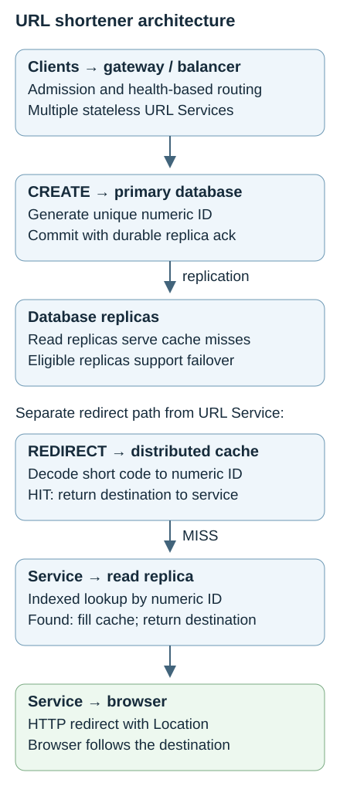
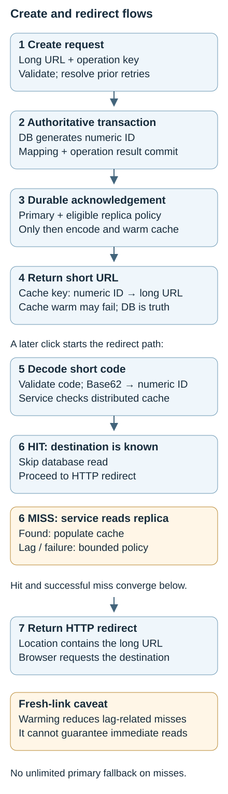
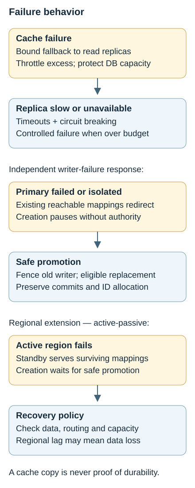

# Topic 2 — URL Shortener

[Back to Architecture Drills](../README.md)

**Status:** Complete

A public URL-shortening service is the vehicle for learning how read-heavy traffic, identifier generation, caching, replication, retries, and failure domains constrain one another. The baseline uses stateless URL Service instances, a relational primary with failover replicas, and a distributed cache backed by read replicas. The database generates a numeric ID; the service Base62-encodes it into a short code.

The design defers distributed ID generation and database sharding until measurement justifies them. Active-passive cross-region recovery is the selected regional-failure extension; active-active writes are not a V1 requirement. Decisions and useful corrections from the drill are retained below, with unresolved production choices called out explicitly.

## Contents

- [Problem & Requirements](#problem--requirements)
- [Final Architecture](#final-architecture)
- [End-to-End Flow](#end-to-end-flow)
- [Component Responsibilities](#component-responsibilities)
- [Key Architecture Decisions](#key-architecture-decisions)
- [Data & Consistency](#data--consistency)
- [Scaling](#scaling)
- [Reliability & Failure Modes](#reliability--failure-modes)
- [Security](#security)
- [Observability](#observability)
- [Constraint Mutations](#constraint-mutations)
- [Adversarial Architecture Review](#adversarial-architecture-review)
- [AI Intersection](#ai-intersection)
- [TPM Delivery](#tpm-delivery)
- [Program Risks](#program-risks)
- [TPM Constraint Mutations](#tpm-constraint-mutations)
- [Concepts Learned](#concepts-learned)
- [Mental Models](#mental-models)

## Problem & Requirements

Accept a long URL, persist its mapping to a compact identifier, and issue an HTTP redirect when someone visits the short URL. Returning a string alone does not complete the product: the browser must be able to follow the stored destination later.

| Requirement | Established in the drill | Architectural consequence |
|---|---|---|
| Creations | 10 million/day ≈ 116 writes/sec average | Start with a single logical writer; benchmark actual peaks. |
| Redirects | 1 billion/day ≈ 11,574 reads/sec average | Roughly 100:1 reads to writes; optimize redirects. |
| Peak assumption | 5× average redirects ≈ 57,870 RPS | Size for bursts, not just the daily average. |
| Latency and availability | Very low redirect latency; high availability | Cache, healthy replicas, and bounded dependency calls. |
| Correctness and durability | Unique mappings; issued links should survive supported failover | Durable creation plus eligible promotion; cache is not authority. |
| Read consistency | Lag acceptable for established, mostly immutable mappings | Replicas can serve reads; newly created links need special care. |
| Creation semantics | Each distinct create operation gets a new short URL | No mandatory long-URL deduplication; retries use idempotency. |
| Abuse resistance | Public creation can attract bots, phishing and malware | Rate limits first, complemented by policy and reputation controls. |

**Scope boundary.** Custom aliases, accounts, expiry, destination editing, billing, and click analytics are optional product extensions. A relational product, node counts, cache sizing, retention, bandwidth, measured capacities, exact SLOs, and regional recovery objectives were not selected. The later p99 < 200 ms versus 600 ms scenario was a delivery exercise, not a finalized production target.

**Capacity correction.** Five billion redirects/day is a valid *equivalent daily volume* for the assumed peak rate if sustained all day. It is not the forecast daily volume. Burst duration, timing, bots, and concentration on one link still require measurement.

## Final Architecture

[Open the scalable architecture diagram](assets/url-architecture.svg)

Creation and redirect are separate paths through the same service capability. Replication runs from the primary to replicas; creation never writes to a read replica. Cache misses are application-managed lookups, not requests forwarded by Redis. Replicas may have both read and failover roles when the database policy permits.

## End-to-End Flow

[Open the scalable flow diagram](assets/create-redirect-flow.svg)

**Create.** The client submits a long URL to the creation API with an idempotency key when retry protection is needed. The service validates the request, checks shared idempotency state, and transactionally inserts the mapping and operation result. The DB generates the numeric primary key. After the required durable acknowledgement, the service encodes the ID, constructs the short URL, attempts a bounded cache warm of **numeric ID → long URL**, and returns the result. A retry resolves the original operation rather than inserting again.

**Redirect.** The service extracts and validates the short code, Base62-decodes it, and checks cache by numeric ID. A hit supplies the destination; a miss causes an indexed read from a healthy read replica and a cache fill on success. The service returns an HTTP redirect with the destination in `Location`; **the browser** then requests that destination. A missing row on a lagging replica is not proof that the link never existed; see [freshness and durability](#data--consistency).

**HTTP choice.** The drill accepted **301** for a lean V1 without hard analytics or destination-change requirements: client/intermediary caching can reduce repeated service traffic. **302** is the preferred alternative when the destination may change or service-side click visibility matters, at higher load. Explicit cache policy still matters: 302 alone does not guarantee every click reaches the service, and cached 301s make later changes or takedowns harder to enforce.

## Component Responsibilities

| Component | Responsibility and reason | Failure impact |
|---|---|---|
| Gateway / load balancer | Apply admission controls; distribute requests across healthy services | A single unprotected entry tier can stop both paths. Health-based routing need not inspect CPU per request. |
| Stateless URL Service fleet | Validate, enforce operation semantics, encode/decode, manage cache/DB calls, issue redirects | Multiple instances support availability; shared dependencies still limit scale. A separate lookup service is unnecessary for V1. |
| Primary DB | Own mappings, numeric ID allocation, transactional idempotency | Creation pauses during loss of authority. |
| Read / failover replicas | Offload redirect misses and provide eligible recovery copies | Lag affects fresh links; lost read capacity increases saturation risk. |
| Distributed cache | Serve ID-to-URL lookups; partition keys and replicate for redundancy | Misses/outage shift load to replicas; one hot key can saturate one owner. |
| HA / recovery infrastructure | Promote safely, route to the valid writer, support the regional extension | Unsafe promotion risks lost mappings, reused IDs, or split brain. |
| SRE / operations | Observe dependencies, provision capacity, test failover and operate runbooks | Hidden degradation becomes a customer-facing incident. |
| Optional async analytics / AI | Analyze traffic and abuse outside redirects | Analysis may lag or stop without blocking normal redirects. |

## Key Architecture Decisions

| Decision / disposition | Why | Alternative and trade-off |
|---|---|---|
| **Accepted:** relational DB first | Simple schema, modest writes, indexed reads, mature transactions | Distributed key-value/NoSQL also fits lookups, but was not justified by current capacity. IDs alone do not imply SQL. |
| **Accepted:** DB numeric ID → Base62 | Database allocation provides uniqueness; encoding provides compactness | Predictable IDs expose enumeration. |
| **Deferred:** Snowflake-style IDs | Avoid worker-ID management, clock regression, and generator operations | Timestamp + worker + sequence can provide distributed uniqueness under its rules if write distribution later requires it. |
| **Not selected:** random, hash, UUID inputs | Base62 can represent any of these; none is needed for the baseline | Random/truncated hashes need collision handling; UUID representations tend to be longer. Encoding fixes neither collisions nor truncation. |
| **Accepted:** new link per distinct operation | Avoid compulsory lookup-before-write; allow separate campaign/ownership contexts | Reuse is a product choice, not universally preferred. Deduplication needs data-layer uniqueness to close races. |
| **Accepted:** shared durable idempotency | Response loss must not produce a second result on retry | Gateway checks, local memory, and redirect cache cannot be the operation's durable authority. |
| **Accepted:** numeric cache keys | Decode once; cache and DB use the same identifier | Short-code keys also work but couple storage to public representation. |
| **Accepted:** cache-aside plus creation warming | Cache on demand, while helping new links resolve before replicas catch up | Warming every new link uses memory even for unvisited links; LRU/LFU and TTL remain separate policies. |
| **Rejected as default:** wait for every read replica | One slow replica should not block all creation | Later acceptance of primary + an eligible replica addresses durability, not freshness on every reader. |
| **Accepted:** one writer with HA replicas | Redundancy does not require simultaneous writers | Sharding and active-active add routing, ID coordination, conflicts and recovery complexity. |
| **Corrected:** spread a viral key's reads | Replicate/fan out hot data or add local/edge caching | Pinning the key to one node, or only adding hash shards, preserves the bottleneck. |
| **Rejected:** CORS as bot defense; synchronous LLM redirects | Direct clients bypass browser restrictions; redirects need deterministic low latency | Rate-limit abuse and run AI asynchronously. |

## Data & Consistency

**Minimum model.** Persist numeric ID and long URL. Creation time, owner, expiry, status, and policy metadata are later options. With a stable Base62 alphabet the short code and full short URL are derivable, so neither needs its own stored field. The primary-key **value** identifies a row; the primary-key **index** is the searchable structure used to locate it efficiently instead of scanning all rows.

**Encoding correction.** Base62 uses 62 symbols, but their ordering must be defined consistently. With alphabet `0123456789ABCDEFGHIJKLMNOPQRSTUVWXYZabcdefghijklmnopqrstuvwxyz`, **125789 ↔ `Wir`**. The conversation's `125789 ↔ X7d` was an illustrative placeholder, not a verified conversion. Base62 is reversible representation, not encryption or a uniqueness generator. Preserve the alphabet, numeric range, and ID uniqueness across upgrades and failover.

**Freshness versus durability.** These are two different failure windows:

| Window exposed in the drill | Chosen response | Limit / clarification |
|---|---|---|
| Primary commits; read replica is two seconds behind; user clicks immediately | Warm cache after the durable write | Helps read-after-create while the entry survives; cache failure, eviction, or another region's cache can still miss. |
| Primary acknowledges; crashes before any replica receives the row | Require primary + at least one eligible durable replica acknowledgement before success | Exact acknowledgement and promotion rules must preserve committed history; an arbitrary lagging replica is not safe. |
| Cache contains a row lost during unsafe failover | Never treat cache presence as durable ownership | The cache can conceal loss only until expiry; recreating a different link does not repair the issued link. |

The drill considered temporary primary reads and bounded primary fallback on replica miss as alternatives to warming. **Production policy remains open:** if immediate resolution is promised, provide a bounded authoritative check or a reader known to have applied the write when warming fails. During unresolved lag or dependency failure, return a controlled temporary failure rather than presenting uncertainty as permanent absence. Do not send unlimited misses to the primary or repeatedly create links after a cache error.

**Retry semantics.** Two intentional submissions of the same long URL may create two links. Repeating one operation with the same idempotency key should return its original link. Persist **operation key → numeric URL ID** in shared durable storage, transactionally with creation, and enforce uniqueness against concurrent service instances. The redirect cache is keyed by URL ID, which a client with a lost creation response does not yet know.

A timeout means unknown outcome. If the first operation committed but its response was lost, its link remains valid; without idempotency the retry creates another valid link, not a replacement for a broken one. Request-key scope, payload mismatch handling, and retention are implementation contracts still to define. They must keep unrelated requests from reusing an operation result.

**Safe authority.** The DB/HA system owns promotion, not custom URL-service voting. Some deployments use consensus; “all relational replicas vote” is not universal. Fence the old writer, choose a sufficiently current replacement, preserve allocator state, and resume only under the required commit policy. Local replica acknowledgement does not by itself promise zero data loss after an entire region fails.

## Scaling

| Area | Reasoning and trigger |
|---|---|
| Redirect load | Replica demand ≈ redirect RPS × (1 − cache hit ratio), excluding retries and special fallback. At 58,000 RPS and 95% hits, about 2,900 reads/sec reach replicas. |
| Cache deterioration | At 40% hits, misses reach about 34,800/sec: **12×** the prior replica load. With no cache, about 58,000/sec: **20×**, before amplification. |
| Application fleet | Add stateless instances for availability and measured compute demand, while bounding aggregate DB connections and downstream work. |
| Writer | Benchmark inserts with actual row size, indexes, replication acknowledgements, log throughput, CPU, IOPS, connections, latency and storage growth. “10k writes/sec” alone proves neither one-primary sufficiency nor a need for two active writers. |
| Storage and cache size | Retention × creations/day × measured record/index footprint determines storage; cache size depends on hot working set and eviction. These inputs were not established. |
| Future DB shards | Decode ID, route to its owning shard, then indexed lookup. Global ID uniqueness must survive multiple shard-local writers; independent auto-increments are insufficient. |
| Shard movement | ID modulo N is simple, but changing N remaps many keys. Consistent hashing limits movement to affected ranges; routing, migration and failover remain operational work. It does not universally guarantee better balance. |
| One viral key | A cached celebrity link at the exercise's 500,000 RPS can overwhelm one node even with a 100-node fleet. Spread reads using hot-key replicas or local/edge caches. |

The drill's example of a writer sustaining 25k writes/sec at p99 < 20 ms was hypothetical benchmark evidence, not a measured capacity claim. Likewise, neither a healthy 95% hit ratio nor low average CPU proves spare capacity at every dependency.

## Reliability & Failure Modes

[Open the scalable failure-flow diagram](assets/failure-flow.svg)

| Failure | Expected behavior | Protection / trade-off |
|---|---|---|
| URL Service instance dies | Route to healthy instances | Redundant fleet and health checks; spare capacity is still needed. |
| Cache node / entire cache tier fails | Healthy cache copies help; misses reach read replicas first | Replicated cache plus bounded fallback, throttling, circuit breakers and backpressure. Replicas must not receive an uncontrolled stampede. |
| Read replicas become slow | Limit waiting and reject excess work | Timeouts, bounded concurrency/queues and connection budgets. Slow dependencies can exhaust resources before they fail outright. |
| Replica lag or fresh-link miss | Warm cache; apply the explicit freshness policy | A missing replica row can be temporary; see [Data & Consistency](#data--consistency). |
| Primary dies | Creation pauses until safe promotion; established redirects can continue from reachable cache/replicas | Preservation of acknowledged mappings matters more than merely promoting a healthy machine. |
| Network partition | Serve available established mappings; stop creates without valid authority | Unreachable is not necessarily dead. Prevent two writers from accepting conflicting state. |
| Whole region fails | Regional extension serves replicated mappings in the standby; creation waits for safe promotion | Active-passive needs data, routing, survivor capacity and tested recovery. Replication lag bounds what survived. |
| Response lost after create | Same operation key returns the committed result | Durable idempotency avoids duplicate creation across retries and restarts. |
| Edge / load balancer lacks redundancy | Both paths can fail despite healthy services | Inspect every shared dependency, including cache, replica count and regional placement. |

**Regional extension.** Region A normally owns creation; Region B holds warm replicated state and may serve reads if provisioned for it. On failure, establish one authoritative writer before resuming creation. Active-active was rejected for this requirement because it complicates ID allocation, conflicts, replication, ordering and reconciliation. Recovery-time and data-loss objectives, promotion eligibility and failback remain production decisions. Replication is not a substitute for tested backups and restoration.

## Security

Rate limiting was the first accepted abuse control for creation. Combine IP, API-key/account, tenant or device dimensions as appropriate; add quotas, CAPTCHA/challenges, suspicious-domain blocking and URL reputation/malware checks where justified. Accounts and private links are extensions, not mandatory V1 features.

**CORS correction.** Browser cross-origin response restrictions do not stop direct API clients and bots from submitting requests. CORS alone cannot prevent mass link creation.

**Enumeration trade-off.** Sequential DB IDs remain guessable after Base62 encoding. The drill considered permutation/obfuscation, non-sequential unique IDs and enumeration limits. None turns a public short code into authorization: private destinations need access controls. If destinations become mutable, expired or blocked, revisit cache invalidation and client redirect caching; the stale-but-correct immutable mapping assumption no longer covers those changes.

## Observability

| Signals | What they distinguish |
|---|---|
| Create/redirect RPS; p50/p95/p99 latency; errors | Separate path health; averages hide slow-tail customer impact. |
| Service CPU, memory, concurrency and waiting | Compute saturation versus dependency or connection pressure. |
| Cache hit ratio, latency, evictions, memory | Working-set changes and impending replica load. |
| DB CPU, memory, IOPS, connections, log throughput | Capacity limits that more service instances cannot fix. |
| Replica lag and apply health | Fresh-link visibility and failover readiness. |
| Key concentration; shard distribution if sharded | One hot key versus a broadly overloaded fleet. |
| Promotion/recovery duration and replication health | Degraded redundancy before the next outage. |

The key diagnostic chain is **hit ratio drops → replica QPS rises → connections/CPU rise → redirect latency grows**. Conversely, healthy cache and replicas with high service CPU point toward the application tier. No fixed “first bottleneck” is correct for every workload.

## Constraint Mutations

| Mutation actually exercised | First pressure / minimal change |
|---|---|
| Creation grows 10× | Re-benchmark the writer under durability and latency requirements; do not shard automatically. |
| Redirects grow 100× and one link dominates | Inspect cache throughput and hot-key ownership first; replicate the hot key or add local/edge caching, then size miss and network capacity. |
| Cache disappears / hit ratio collapses | Replica load rises first; bound admission and fallback instead of cascading to the writer. |
| Read DB becomes slow | Stop accumulating work with timeouts, circuit breaking and backpressure. |
| Primary isolated / fails | Preserve established reads; pause creation until authoritative failover is safe. |
| Region fails | Add active-passive regional recovery, adequate replicated state and capacity. |

**Proposed but not completed as separate drills:** collision-rate growth under alternative IDs, global expansion beyond regional failover, data residency, tighter latency targets and budget cuts. They are future exercises, not accepted architectures. With correct unique DB IDs and lossless Base62, probabilistic short-code collision handling is not part of the baseline.

## Adversarial Architecture Review

| Challenge / earlier proposal | Resolution |
|---|---|
| Why not remove cache and just add read replicas? | Cache offloads most reads and absorbs popular-link traffic cheaply; replicas still handle misses. Cache capacity and failure remain real dependencies. |
| Is the URL Service always the first bottleneck? | No. Normal growth depends on cache efficiency and replica headroom; a viral hit stresses cache, while high service CPU can independently become limiting. |
| Are multiple API instances over-engineering? | They remove an application SPOF. Premature DB sharding is the stronger over-engineering example. |
| Why is one primary enough? | It is a starting hypothesis supported by modest average writes, not a universal guarantee. Test the actual workload with headroom. |
| Would two primaries improve HA? | Multiple physical DB nodes help HA; multiple concurrent writers solve a different problem and require coordination. |
| Does Base62 guarantee uniqueness or hide the sequence? | Neither. The allocator supplies uniqueness; encoding remains enumerable. |
| Can cache or gateway identify a retried create? | Redirect cache cannot infer the lost operation; gateway validation is not durable transactional idempotency. |
| Can one isolated cache node protect a celebrity URL? | Isolation concentrates the load. Fan out reads for the same key. |
| Does waiting for replication settle all correctness? | Durability, reader apply state and safe promotion are separate requirements. |

## AI Intersection

**Accepted placement: asynchronous, outside the redirect critical path.** AI may analyze hot URLs/customers, cache-hit anomalies, unusual traffic and capacity trends. Malicious-URL classification was considered as an optional extension with deterministic fallback and human review for ambiguity. An LLM on every redirect adds latency, cost, nondeterminism and a failure dependency without improving deterministic lookup.

Privacy, retention, model quality and inference budget were requested discussion dimensions but were not specified in detail. Before implementation, minimize sensitive URL/customer data in analytics, evaluate false positives/negatives, define human ownership, and keep model failure from stopping ordinary redirects. These are implementation follow-ups, not completed design decisions. Background workers, analytics storage, pre-aggregation and a transactional outbox appeared as prior knowledge; no concrete event-delivery architecture was selected here.

## TPM Delivery

| Workstream | Deliverable / dependency |
|---|---|
| Architecture / business analysis | Confirm scope, link/retry behavior, SLOs and acceptance criteria. |
| API / application | Creation and redirect capability, encoding, bounded calls and idempotency integration. |
| DB / data | Schema, indexed access, shared operation state, endpoints, replication and safe promotion. |
| Cache / platform | Cache integration, eviction, redundancy and failure behavior. |
| Infrastructure | Environments, networking, load balancing and deployment capacity. |
| InfoSec | Early abuse/security requirements, validation and residual-risk decisions. |
| SRE / observability | Early telemetry and availability standards; dashboards, alerts and support model. |
| QA / integration | Start test strategy with development; validate integrated correctness, load and failure behavior. |
| Analytics, if scoped | Async analysis with separate acceptance criteria and dependencies. |
| Release / operations / mandatory operational requirements | Runbooks, DR readiness, access, change approvals, rollout/rollback and handoff. |

**Sequencing correction.** API, DB, cache, infrastructure, architecture, QA planning, InfoSec requirements and SRE design start in parallel. Security and SRE must not wait until mid-development; their implementation and detailed validation can ramp later. Mid-stage work adds dashboards, analytics if selected and runbook preparation.

**Integration gate.** API + DB + cache + infrastructure need usable contracts and capabilities for end-to-end testing. Component completion alone does not prove the system. Late gates cover performance, resilience, security, DR/failover, operational acceptance and rollout/rollback validation. Specific dates, staffing and named owners were not assigned.

**Readiness evidence.** Validate create-to-immediate-redirect, hit/miss paths, concurrent retries and lost responses, cache outage, slow/lagging replicas and primary promotion. For the regional extension, verify surviving mappings, routing and capacity. Agree launch thresholds, decision owners, monitoring and rollback triggers; these operationalize the drill rather than claim tests already passed.

## Program Risks

| Risk surfaced | Mitigation / accountable function |
|---|---|
| DB dependency delays integration | TPM + DB lead isolate the true critical-path deliverable and release usable capabilities incrementally. |
| Cache protection hides insufficient replica capacity | Platform + SRE + performance QA exercise cache loss and bounded fallback. |
| Freshness or durability assumptions exceed actual HA policy | DB + API owners validate acknowledgement, read routing and promotion together. |
| Viral traffic defeats aggregate sizing | Platform + SRE test skew and hot-key mitigation, not only uniform load. |
| Late security / operational engagement | Engage requirements owners at inception; make acceptance visible before release. |
| Fixed deadline despite performance failure | Engineering + performance team tune and retest; Product/leadership decide reduced scope or explicit residual risk. |
| Serious abuse vulnerability near launch | Security validates compensating controls; accountable business leadership owns the launch decision. |
| Unproven regional recovery | Infrastructure + DB + SRE demonstrate DR readiness before claiming regional resilience. |

These risks consolidate the architecture and delivery discussion; they are not a claim that a formally scored or staffed risk register was produced.

## TPM Constraint Mutations

| Disruption | Response and decision boundary |
|---|---|
| **DB platform slips three weeks** | Keep API work moving with mocks/stubs, contracts and unit tests. Identify whether schema, endpoint, writes or replication actually gates integration; negotiate partial DB deliveries for phased integration and escalate that critical subset. Mocks do not replace integrated evidence. |
| **High redirect p99; healthy cache/replicas; high service CPU; fixed launch date** | Investigate code, concurrency, runtime/GC and capacity; tune and retest first. Define acceptable thresholds and owners. For a controlled residual miss, reduce initial scope/traffic via canary or parallel run; retain the old system as driver/fallback only if one exists. Monitor p99, CPU, errors and saturation against rollback triggers. |
| **Serious abuse vulnerability two days before launch** | Convene Security, Engineering, Product/Business, Operations and accountable leadership. Establish severity, exploitability, blast radius and fix feasibility. Evaluate rate limits, CAPTCHA, account-only creation, domain blocks, reduced scope or disabling anonymous creation. Security assesses residual risk; record the decision, owner, remediation deadline and rollback trigger. If no acceptable control exists, escalate for launch delay. |

A canary does not waive an unmet critical performance requirement. A fixed date does not make unacceptable security risk acceptable, and the TPM does not personally accept that risk. Executive communication should present impact, recovery choices and the decision needed. Cache-platform delay, staffing loss and regional-deployment delay were suggested scenarios, not completed delivery drills.

## Concepts Learned

| Concept | Working meaning / correction |
|---|---|
| Rate versus volume | Daily counts become RPS by dividing by 86,400; peak duration remains a separate input. |
| Base62 / allocator | Representation versus source of uniqueness; a fixed alphabet makes decoding deterministic. |
| Primary key / index | Identifier value versus the structure that finds its row. |
| Deduplication / idempotency | Reuse across distinct requests versus one result across retries of the same operation. |
| Cache-aside / warming / eviction | Fill on read miss / seed known new mappings / choose what stays; none alone proves freshness. |
| Replica / shard / hot key | Copy of state / subset of ownership / concentrated demand for one key. |
| Consistent hashing | Reduce remapping on membership change; not a single-hot-key remedy. |
| Durability / read visibility | Surviving acknowledged state versus whether a particular reader can see it yet. |
| HA / active-active / split brain | Redundant recovery / concurrent writers / conflicting authority during failure. |
| Timeout / backpressure / circuit breaker | Bound waiting / limit incoming work / stop repeated calls to an unhealthy dependency. |
| 301 / 302 | Permanent versus temporary redirection, with caching, analytics and mutability trade-offs. |
| Critical path / canary / compensating control | Gating dependencies / limited exposure / a verified alternative control for a specific risk. |

## Mental Models

- The database creates the unique number; Base62 changes its representation.
- Correct mapping does not require the freshest read everywhere when mappings are immutable.
- Warm cache bridges a lag window; it does not establish durable truth.
- A timeout means uncertainty, not proof that creation failed.
- Deduplication is a product choice; idempotency protects one operation's retries.
- The service returns a redirect; the browser follows it.
- Cache hit ratio is a database capacity signal, not just a cache statistic.
- Sharding distributes many keys; replication can distribute reads for one hot key.
- More machines do not necessarily mean more active writers.
- Scale the writer from evidence, not the emotional size of an RPS number.
- Existing reads can survive failures that stop safe creation.
- Bound fallback before a partial outage becomes a full outage.
- AI can advise asynchronously; deterministic lookup needs no model.
- Start security and operations early; integration proves the pieces work together.
- A deadline can change scope and exposure; it cannot replace readiness evidence.

---

**Chapter provenance:** Completed Topic 2 URL Shortener drill, including its accepted choices, rejected proposals and corrections. Numerical scenarios are teaching assumptions, not benchmarks. Production clarifications and uncompleted proposed exercises are identified explicitly. Previous: [Topic 1 — Architecture Foundations](../01-architecture-foundations/README.md). Next: [Topic 3 — Rate Limiter](../03-rate-limiter/README.md).
