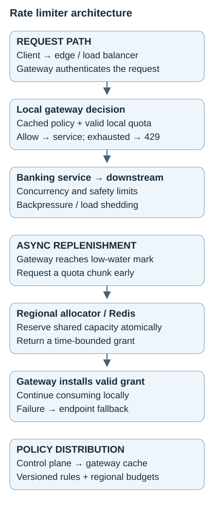
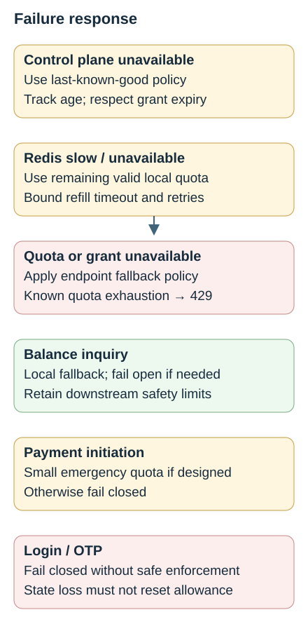
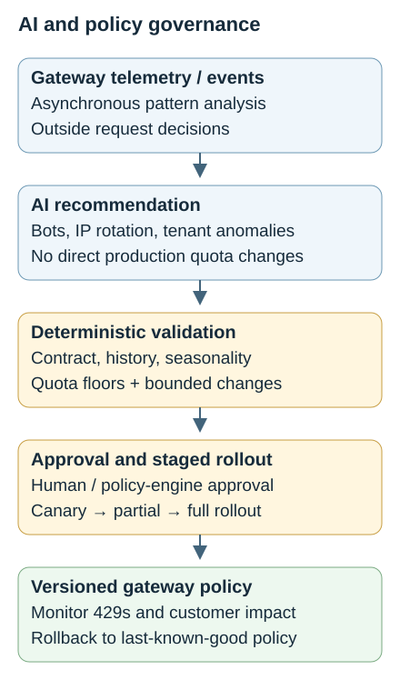

# Topic 3 — Rate Limiter

[Back to Architecture Drills](../Main%20Readme/README.md)

**Status:** Complete

A banking API is the vehicle for learning fair admission, burst control, atomic counters, distributed quota ownership, and failure trade-offs. The selected design enforces authenticated-user policies at the API Gateway, using **guaranteed local quota + shared burst capacity**. Regional Redis-backed allocators coordinate grants; gateways serve most requests locally with cached policy.

The drill evolved from per-request shared counters to asynchronous quota replenishment. Service-level concurrency and capacity controls remain necessary. Decisions, rejected proposals, and corrections are retained below; numerical scenarios are teaching assumptions, not measured production capacities.

## Contents

- [Problem & Requirements](#problem--requirements)
- [Final Architecture](#final-architecture)
- [End-to-End Flow](#end-to-end-flow)
- [Component Responsibilities](#component-responsibilities)
- [Key Architecture Decisions](#key-architecture-decisions)
- [Algorithms](#algorithms)
- [Data & Consistency](#data--consistency)
- [Scaling](#scaling)
- [Reliability & Failure Modes](#reliability--failure-modes)
- [Security](#security)
- [Observability](#observability)
- [Constraint Mutations](#constraint-mutations)
- [Adversarial Architecture Review](#adversarial-architecture-review)
- [AI Intersection](#ai-intersection)
- [TPM Delivery](#tpm-delivery)
- [Program Risks](#program-risks)
- [TPM Constraint Mutations](#tpm-constraint-mutations)
- [Concepts Learned](#concepts-learned)
- [Mental Models](#mental-models)

## Problem & Requirements

Protect `GET /accounts/{id}/balance` against runaway clients, bots, abuse, and unfair consumption without blocking legitimate corporate users. The service can handle aggregate traffic in the initial exercise; fairness and abuse protection motivate the limiter.

| Requirement | Established in the drill | Consequence |
|---|---|---|
| Baseline | 8,000 RPS normal; 20,000 RPS peak; 12 gateways; 30 Balance Service instances | Enforce before downstream work; coordinate across gateways. |
| Primary identity | Authenticated employee/user; example 120 requests/min total | One user cannot multiply quota by changing gateway or IP. |
| Layered protection | IP as coarse abuse signal; account as broader ceiling; tenant/API key and endpoint policies | A global 20,000 RPS ceiling alone allows one customer to monopolize traffic. |
| Legitimate sharing | Hundreds of employees can share an account; thousands can share a NAT/proxy IP | Neither account nor public IP is a reliable individual identity. |
| Client response | Allow or reject; HTTP 429 on quota exhaustion | Supply Retry-After where meaningful; clients add jitter and progressive backoff. |
| Latency mutation | Gateway overhead below 5 ms p95 while Redis reaches 25 ms p95 | Local decisions with early asynchronous replenishment. |

**Scope boundary.** Exact production quotas, SLOs, lease durations, clock tolerance, emergency budgets, Redis topology, durability policy, and regional recovery targets were not finalized. The later 10-gateway and 100,000 RPS scenarios change assumptions deliberately; they are not baseline forecasts. Authentication and payment correctness remain separate controls.

## Final Architecture

[Open the scalable architecture diagram](assets/rate-architecture.svg)

The load balancer and gateway route requests. Redis coordinates quota ownership; it does not redirect traffic. The control plane is logically centralized and may be replicated. Policies and grants reach gateways outside the normal request path. A valid local grant permits consumption only while all applicable admission and downstream safety rules permit it.

## End-to-End Flow

1. **Identify.** Edge controls screen coarse abuse; the gateway authenticates and derives trusted user, tenant/API-key, account, and endpoint policy dimensions.
2. **Evaluate locally.** Read the last-known-good policy, verify grant validity, and apply the selected bucket/counter plus relevant concurrency and capacity checks.
3. **Admit or reject.** Consume local capacity atomically and forward admitted traffic to the banking service. Known quota exhaustion returns **429 Too Many Requests**, with meaningful Retry-After guidance. Dependency failure follows the endpoint's fallback policy.
4. **Replenish early.** At a low-water mark, asynchronously request a chunk from the regional allocator. The exercise suggests **20–30% remaining**; tune this against consumption and refill latency. Redis atomically reserves available shared capacity; the gateway accepts a valid grant.
5. **Bound degradation.** If refill fails before local capacity runs out, continue within valid remaining quota. Once exhausted or expired, apply the endpoint-specific fallback or reject; do not wait indefinitely for Redis.
6. **Protect downstreams.** Services enforce concurrency, bounded queues, load shedding, backpressure, and circuit breakers as required, including for internal callers and retries that bypass the gateway.

**Evolution retained.** The earlier flow borrowed synchronously after local exhaustion. The latency mutation improved it to prefetch before exhaustion, making Redis a replenishment dependency rather than a per-request dependency. Client retries use Retry-After plus random jitter; identical delays synchronize thousands of clients into a thundering herd.

## Component Responsibilities

| Component | Responsibility | Failure impact |
|---|---|---|
| Edge / load balancer | Coarse abuse checks and routing to healthy gateways | Entry-tier failure can block otherwise healthy services. |
| Gateway data plane | Authenticate, apply cached policy, consume local quota, allow/reject, return 429 | Lost local state requires conservative grant recovery; independent full quotas over-admit. |
| Control plane | Define quotas, publish/version policies, allocate regional budgets, issue/renew/revoke leases, audit and govern rollout | Cached policy can continue, but freshness and grant validity are separate concerns. |
| Regional allocator / Redis | Atomic shared reservations and coordination state | Slowness impairs replenishment; state loss can invalidate quota accounting. |
| Banking services | In-flight limits, load shedding, backpressure, circuit breakers | A customer within quota can still overload a slow dependency. |
| Telemetry / asynchronous AI | Detect anomalies and recommend governed policy changes | Analysis can lag or stop without blocking requests. |

Policy distribution and lease issuance/renewal belong to the **control plane** in this drill. Receiving policies and consuming granted tokens belong to the **data plane**.

## Key Architecture Decisions

| Decision / disposition | Why | Alternative and trade-off |
|---|---|---|
| **Accepted:** authenticated user first, layered limits | Preserves fairness across shared corporate networks/accounts | IP remains useful for abuse; a strict shared-IP quota can block healthy users. |
| **Accepted:** gateway enforcement plus service protection | Reject early while protecting bypass/internal paths | Clients cannot be trusted to enforce their own quotas. |
| **Rejected:** full policy independently on each gateway | 12 × 120/min admits 1,440/min; 10 buckets of burst 100/refill 20 permit burst 1,000 and 200 RPS | Allocate portions of the policy or coordinate shared state. |
| **Baseline, then refined:** shared Redis per request | One logical counter closes the fleet-wide accounting gap | Network latency, availability coupling, operations per request, and hot keys motivate local grants. |
| **Rejected:** GET → decide → INCR; polling who asked first | Concurrent callers can spend the same final slot | Atomic updates/reservations establish one allocation outcome. |
| **Accepted:** guaranteed local quota + shared burst | Keeps normal requests local and helps busy gateways borrow | Static slices alone strand capacity; shared capacity is finite. |
| **Rejected:** Redis redirects to quiet gateways | Quota coordination is distinct from request routing | Load balancer/gateway owns routing. |
| **Accepted:** leases, expiry, renewal, versions/fencing | Limits stranded ownership and stale-grant use | Heartbeat loss alone does not prove the gateway is dead. |
| **Rejected:** consistent hashing fixes one hot customer | One key still maps to one shard | Split bounded allocations; reduce coordination with local consumption. |
| **Accepted:** regional quotas and cached policy | Low latency and regional independence | Fragmentation, stale policy, and explicit consistency trade-offs remain. |
| **Rejected:** critical always means fail closed; AI decides requests | Endpoint risk differs; model calls add latency and nondeterminism | Govern fallback per endpoint and keep AI advisory. |

## Algorithms

| Algorithm | Mechanism / example | Selection and limit |
|---|---|---|
| Fixed Window | One counter per subject/rule/window; 120/min | Simple and cheap when boundary bursts are acceptable. 120 at 10:51:59 plus 120 at 10:52:01 admits 240 in about two seconds. |
| Sliding Window Log | Store individual timestamps; remove entries older than the rolling window | Accurate but memory and cleanup intensive at 20,000 RPS. Not selected for the high-volume balance example. |
| Sliding Window Counter | Current count + weighted previous count | Approximate and compact; selected where smoother rolling enforcement matters. High traffic alone does not mandate it. |
| Token Bucket | Capacity **10 tokens**, refill **2 tokens/sec** | Selected for mobile balance traffic: allow ten immediately when full, then refill at the sustained rate. Capacity is a burst amount, not 130 requests/min. |
| Leaky Bucket | Bounded queue drains at a controlled rate; ten arrivals released at 2/sec | Selected to smooth traffic into a legacy fraud service; reject/drop on queue overflow and bound waiting. The separate fraud example requires a smooth 2,000 RPS. |

**Sliding counter arithmetic.** With previous minute = 100 and current minute = 40, halfway through the current minute the estimate is `100 × 0.5 + 40 = 90`; a 120 limit leaves approximately 30 requests. At ten seconds into the minute, previous = 100 and current = 100 yields `100 × 50/60 + 100 ≈ 183`, so reject. Weighting estimates overlapping historical usage; it does not create a per-second allowance. Logs versus counters means individual timestamps versus aggregated totals, not milliseconds versus seconds.

## Data & Consistency

**Keys and atomicity.** A key such as `rate:user123:balance:2026-09-13T10:51` identifies whose traffic, which endpoint/rule, and which window; its value is usage. In the fixed-window baseline, atomic INCR returns 120 to one gateway (allow) and 121 to another (reject). This counts attempts, including denied ones; counting only admitted work requires an atomic check-and-consume operation.

**Production clarification:** counter creation and expiry must be safe together; separate increment and expiry steps can leave immortal keys after a failure. Window identity determines the reset boundary; TTL cleans up obsolete state. Keep previous buckets long enough for sliding-window overlap. Token refill and consumption also need atomicity wherever concurrent workers share state.

**Guaranteed local quota + shared burst capacity.** For **10,000 requests/min across ten gateways**, allocate **800 locally each = 8,000**, leaving **2,000 shared**. Both are parts of the same budget, not additive entitlements beyond 10,000. A busy gateway can request 500 more. With only 500 left and two gateways asking for 400, the allocator must atomically check, subtract, and grant: one gets 400, leaving at most 100 for the other.

**Leases and partitions.** A gateway granted 500 that uses 50 then crashes strands 450 unless ownership can expire. Renewals/heartbeats, short explicit expiries, lease versions/fencing, and conservative partition behavior protect reallocation. A partitioned gateway may still serve traffic after its heartbeat disappears; reassigning its grant while it continues spending doubles the capacity.

**Production clarification:** expiry does not reveal how many tokens were spent. Reclaim only provably unused capacity, or conservatively wait for the accounting window to end. Gateways must stop using expired grants; a fencing number alone cannot stop an isolated local decision unless validity is enforced. Clock safety, grant retry deduplication, restart recovery, and failover accounting must be specified before promising exact enforcement. Cached policy does not extend an expired lease.

**Multi-region.** Split a global **100,000/min** into Canada **30,000**, US **50,000**, and Europe **20,000**, enforced with regional counters. This avoids a cross-region request-path call. Canada can reject at 30,000 while Europe uses only 5,000; periodic rebalancing or governed overflow reduces fragmentation at added coordination cost.

Strict, non-overlapping regional allocations can preserve a global cap if accounting and transfers are safe. Approximation or over-admission enters through relaxed coordination, fallback, or unsafe reallocation; it is not inherent to partitioning a budget. The drill tolerates slight cross-region over-admission for **balance inquiry**, while **OTP at 20/min** needs tighter coordination or conservative allocations. Exactness, low latency, availability, and regional independence cannot all be maximized during partitions.

## Scaling

| Pressure | Response and trade-off |
|---|---|
| 20,000 RPS with multiple policy dimensions | Per-request shared checks may exceed 20,000 Redis operations/sec. Consume local chunks and measure coordination cost. |
| One customer causes 40% of checks | Ordinary sharding and consistent hashing retain a single-key hotspot. Use local allocations, bounded subkeys, and hierarchical accounting. |
| Uneven traffic | Static 1,000/gateway rejects a gateway receiving 3,000 while a gateway receiving 200 leaves 800 idle. Shared overflow helps until depleted; rebalancing is still needed. |
| Chunk size | Larger grants reduce Redis calls but increase stranded capacity and recovery exposure; smaller grants increase coordination. |
| Fleet growth | Reallocate the existing budget; new gateways must not mint a new full customer quota. |
| Slow fraud service | Cap in-flight work at the example's 2,000; release slots on completion, failure, or timeout. An RPS limit alone does not bound active work. |

## Reliability & Failure Modes

[Open the scalable failure-flow diagram](assets/failure-flow.svg)

| Failure / endpoint | Chosen behavior | Protection / limit |
|---|---|---|
| Control plane unavailable for ten minutes | Continue last-known-good cached policy | Track version/age, alert, and define maximum staleness for high-risk rules; leases still expire independently. |
| Redis slow or unavailable | Short timeouts; continue valid local allocations; apply fallback when necessary | Prevent replenishment from stalling request handling. |
| Balance inquiry | Fail open for limiter uncertainty; use local fallback state | Tolerate temporary approximation; downstream safety controls still apply. |
| Payment initiation | Fail closed, or a small bounded local emergency quota if designed | Mature preference is bounded availability; never unlimited traffic on Redis loss. |
| Login / OTP | Fail closed when trustworthy enforcement is unavailable | Restrictive fallback needs an explicit safe design; prevent brute-force and OTP abuse. |
| Redis state lost | Balance can use local state with limited over-admission | OTP must not reset to zero and issue a fresh quota; use trustworthy recent state, restrictive fallback, or fail closed. |
| Gateway crash / network partition | Expire ownership and recover conservatively | Prevent stale spending and unsafe reclaim of possibly consumed tokens. |
| Bad global policy, such as OTP = 0/min | Validate, approve, canary, monitor, and roll back | Versioned last-known-good configuration and audit trail constrain blast radius. |
| Synchronized retries | Retry-After plus client jitter and progressive backoff | Identical retry delays reproduce the spike. |

Known quota exhaustion and inability to establish safe enforcement are different conditions. The drill chose 429 for exhaustion; dependency-failure response codes and retry contracts remain implementation decisions.

## Security

Use authenticated user identity as the primary corporate-banking subject, account limits as broader ceilings, and IP as a coarse abuse layer. Combine tenant/API-key and endpoint policies where relevant; avoid treating a shared NAT address as a machine identity or one composite key as a substitute for independent safety ceilings.

Login and OTP quotas are abuse controls, so state loss and cross-region duplication require conservative handling. Guard policy changes with validation, approval for high-risk changes, versioning, canaries, auditability, and local sanity checks. A suspicious drop from 20/min to zero should trigger explicit review/authorization rather than blind global enforcement. Rate limiting does not replace authentication, authorization, or payment idempotency.

## Observability

| Signals | What they reveal |
|---|---|
| Gateway p95/p99 overhead, request rate, errors | Whether local admission meets the latency budget. |
| Allows, 429 rate, quota exhaustion by endpoint/tenant | Abuse versus unintended customer denial; avoid uncontrolled identity-label cardinality. |
| Local grant utilization, shared-pool depletion, refill latency/failures | Fragmentation, starvation, and late replenishment. |
| Redis latency, shard load, hot keys, state recovery | Shared coordination saturation or loss of trustworthy accounting. |
| Policy version/age, stale-policy alerts, lease expiry/renewal failures | Configuration divergence and invalid ownership. |
| Downstream concurrency, saturation, OTP/payment success, customer impact | Whether quotas actually protect services without unacceptable denial. |

Agree SLI/SLO definitions, alert thresholds, and rollback triggers before launch. None of the exercise values is evidence that a production system passed these checks.

## Constraint Mutations

| Changed constraint | Accepted response | Incomplete proposal / correction |
|---|---|---|
| Redis rises from 1 ms to 25 ms p95; gateway must stay below 5 ms p95 | Local request decisions, chunked asynchronous replenishment, early low-water trigger, bounded timeout/fallback | Redis rebalancing may relieve a shard but does not remove synchronous dependency latency. Waiting until zero is too late. |
| Tenant A legitimately produces 60% of 100,000 RPS | Reserve up to 60,000 RPS for A, protect the remainder for others, enforce tenant ceiling, and govern optional overflow | Simply allocating more tokens can still starve other tenants. |
| A has 60,000 RPS entitlement; payment service supports only 40,000 total | Downstream safety ceiling wins; add concurrency limits, load shedding, and backpressure | Contractual quota is not a promise to admit unsafe work. Capacity and entitlement must be reconciled operationally. |

The priority is **downstream safety ceiling → tenant quota → individual-user quota**: admission must satisfy applicable constraints. Reserved quota provides isolation only within provisioned safe capacity.

## Adversarial Architecture Review

| Challenge | Outcome retained |
|---|---|
| Two gateways see 119/120 | Atomic update admits only one final slot. |
| Two gateways request the same shared 500 | Atomic reservation prevents double allocation. |
| A partition looks like a crashed gateway | Heartbeat absence is insufficient; enforce expiry and safe ownership transfer. |
| One hot key overwhelms a shard | Consistent hashing moves ownership; it does not distribute that key's checks. |
| Global OTP counter disappears | Do not reset abuse history into fresh entitlement. |
| OTP policy becomes zero globally | Policy validation and staged rollout address the cause; checking backup counters does not validate configuration. |
| AI proposes 20,000 RPS → 500 RPS for a healthy customer | Validate entitlement and history; bound changes, approve, canary, and roll back on impact. |

## AI Intersection

**Selected:** gateway telemetry/events feed asynchronous analysis of bots, unusual tenant behavior, IP rotation, credential stuffing, and traffic-shape changes. AI emits a risk signal or recommendation; deterministic control-plane rules govern any policy update. Token buckets, counters, quotas, and concurrency limits continue to decide requests.

[Open the scalable AI and policy flow](assets/ai-policy-flow.svg)

For a proposed **20,000 → 500 RPS** cut, validate contracted entitlement, historical usage, seasonal peaks, incident context, minimum quota floors, and maximum percentage change. Require human or policy-engine approval for large reductions, canary the change, and automatically roll back if 429s, errors, or customer-impact signals spike. Model confidence is insufficient authorization. Synchronous AI adds latency, cost, nondeterminism, and a new availability dependency.

## TPM Delivery

Organize by cross-team outcomes rather than naming teams alone.

| Workstream | Owners / participants | Deliverable |
|---|---|---|
| Enforcement & Gateway Integration | Gateway + Security + service teams | Subjects, algorithms, endpoint fallback, 429 behavior, and service protection. |
| Distributed Quota & Platform Reliability | Redis/Platform + Gateway + SRE | Atomic counters/reservations, leases, local grants, shared burst, hot-key mitigation, regional strategy and failover. |
| Policy, Rollout & Observability | Control-plane + Security + SRE | Policy management/versioning, auditing, dashboards, alerts, canary, rollback, and customer-impact monitoring. |

**Minimum production-readiness gates:**

| Gate | Required evidence |
|---|---|
| Dev / unit testing | Limiter logic, token arithmetic, TTL, atomic operations, and endpoint fail-open/fail-closed paths. |
| E2E integration | Gateway, Redis, control plane, service dependencies, 429 handling, and policy propagation. |
| Performance / resilience | Concurrent and peak traffic, bursts, hot keys, Redis latency/failure, partitions, state loss, and regional degradation. |
| Implementation checklist | Configuration, ownership, runbooks, feature flags, policy versions, and executable rollback steps. |
| InfoSec review | Abuse scenarios, login/OTP protection, tenant isolation, and audit controls. |
| Mandatory operational readiness | Support model, incident procedures, alert thresholds, dashboards, and capacity assumptions. |
| SRE / observability handover | SLIs/SLOs, 429s, Redis latency, quota exhaustion, hot keys, stale policy, and lease failures. |
| Final Go / No-Go | Evidence-based decision, named accountable owners, accepted customer impact, and rollback readiness. |
| Controlled rollout | **Shadow mode → canary → partial traffic → full enforcement**, with impact checks and rollback at each step. |

These are release requirements, not completed implementation tests. Dates, staffing, named individuals, numerical acceptance thresholds, and exact rollout percentages were not assigned in the drill.

## Program Risks

| Risk consolidated from the drill | Mitigation / accountable function |
|---|---|
| Gateway/allocator contracts disagree on ownership | Gateway + Platform verify reservation, retry, expiry, and recovery together. |
| Redis latency violates gateway budget | Platform + SRE measure peak/skewed traffic and prove local replenishment behavior. |
| Tenant entitlement exceeds downstream capacity | Service + capacity/business owners reconcile provisioning, isolation, and safe admission. |
| Bad policy or AI recommendation blocks customers | Control-plane + Security enforce guardrails, canaries, audit, and rollback. |
| Failover restores availability but loses quota history | Platform + Security verify conservative login/OTP recovery. |
| Launch gates omit real customer impact | TPM + SRE + service owners validate success metrics and rollback before expansion. |

This consolidates architectural risks into delivery responsibilities; it is not a formally staffed risk register.

## TPM Constraint Mutations

No separate schedule-slip, staffing, or deadline mutation was completed for Topic 3. The completed delivery exercise defined workstreams and readiness gates; the Redis latency, tenant isolation, and downstream capacity mutations above supply the resilience and capacity evidence those workstreams must produce.

## Concepts Learned

| Concept | Working meaning / correction |
|---|---|
| Rate limit / quota | Traffic per time interval / entitlement to consume. |
| Concurrency limit | Simultaneous active work; release on every terminal path. |
| Backpressure / load shedding | Ask upstream to slow / reject work to preserve health. |
| Circuit breaker / retry | Stop calls to an unhealthy dependency / attempt work again under bounded policy. |
| Token / leaky bucket | Permit controlled bursts / smooth output through bounded queuing. |
| Sliding log / counter | Individual timestamps / approximate aggregate buckets. |
| Atomicity | One indivisible state transition; “concurrency” alone does not close a race. |
| TTL / lease | State retention / time-bounded ownership; neither proves unused quota. |
| Fragmentation / hot key | Unused capacity trapped elsewhere / concentrated demand on one owner. |
| Control / data plane | Define and distribute rules/grants / enforce them on requests. |
| Fail open / fail closed | Allow on limiter uncertainty / reject on limiter uncertainty. |

## Mental Models

- A quota needs an identity, a scope, and a time model.
- Local full quotas multiply; local allocated quotas divide a shared budget.
- Bucket capacity controls bursts; refill rate controls sustained traffic.
- Redis allocates capacity; the gateway routes requests.
- Borrow early, before local capacity is empty.
- Missing heartbeats do not prove a gateway has stopped spending.
- Cached policy can survive an outage; expired ownership cannot.
- Sharding many keys does not fix one hot key.
- Being within entitlement does not override downstream safety.
- AI recommends; deterministic controls govern and enforce.
- Delivery readiness requires cross-team evidence and controlled customer exposure.

---

**Chapter provenance:** Completed Topic 3 Rate Limiter drill, including accepted/rejected choices, architecture evolution, constraint mutations, AI intersection, and TPM delivery/readiness. Production clarifications and unresolved implementation contracts are labeled explicitly. Previous: [Topic 2 — URL Shortener](../02-url-shortener/README.md). Next: [Topic 4 — API Gateway & Global Load Balancing](../04-api-gateway-global-load-balancing/README.md).
