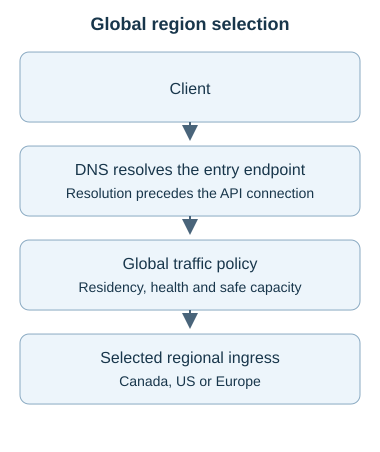
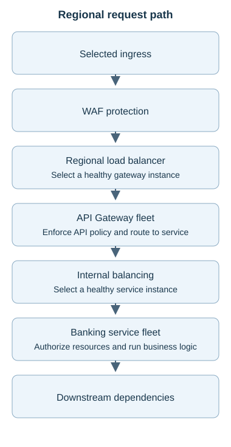
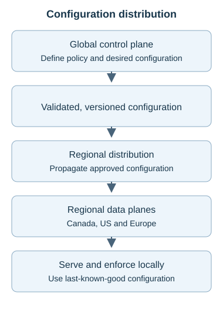
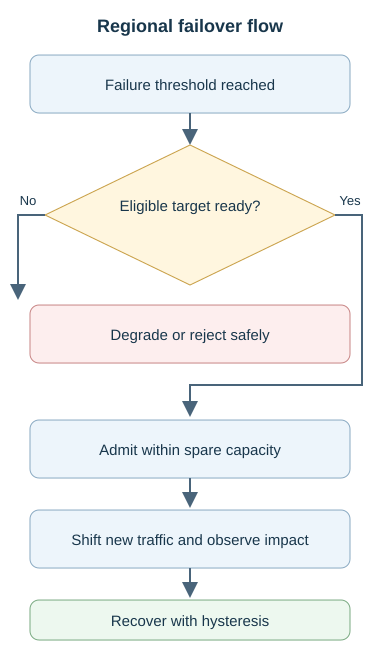
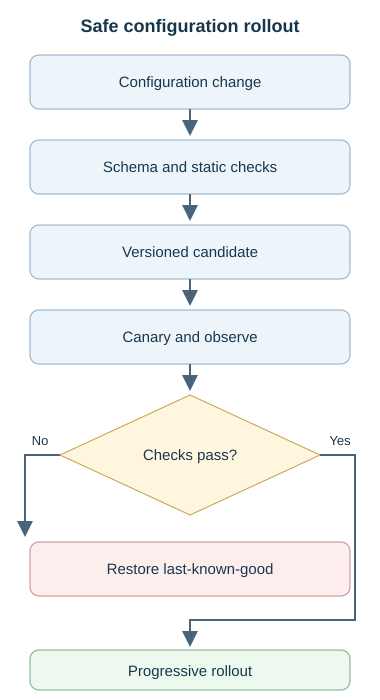
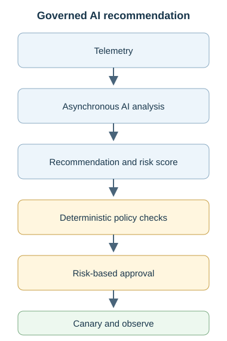
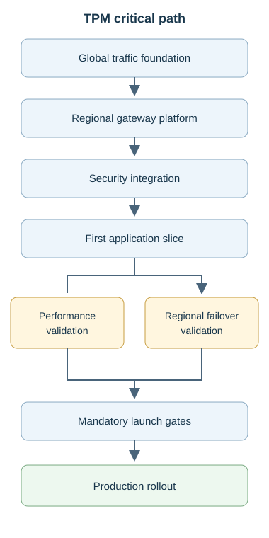

# Topic 4 — API Gateway + Global Load Balancing

[Back to Arch Drills](../README.md)

**Status:** Complete

A multi-region banking platform is the vehicle for learning API policy enforcement, instance balancing, global traffic steering, regional independence, and safe failure recovery. The selected architecture separates **global region selection → regional gateway balancing → API policy/service routing → service-instance balancing**. Regional data planes serve requests using locally available configuration; the global control plane manages policy outside the request path.

The drill evolved from one Canadian region to Canada, US, and Europe. A specific single-writer, five-minute recovery scenario selected **active-passive with a warm US standby**; later mutations change residency and recovery requirements. Decisions, rejected proposals, and corrections are retained below. Numerical scenarios are teaching assumptions, not measured production capacities.

## Contents

- [Problem & Requirements](#problem--requirements)
- [Final Architecture](#final-architecture)
- [End-to-End Flow](#end-to-end-flow)
- [Component Responsibilities](#component-responsibilities)
- [Key Architecture Decisions](#key-architecture-decisions)
- [DNS & Global Traffic Steering](#dns--global-traffic-steering)
- [Data & Consistency](#data--consistency)
- [Scaling](#scaling)
- [Reliability & Failure Modes](#reliability--failure-modes)
- [Security](#security)
- [Configuration Safety](#configuration-safety)
- [Observability](#observability)
- [Constraint Mutations](#constraint-mutations)
- [Adversarial Architecture Review](#adversarial-architecture-review)
- [AI Intersection](#ai-intersection)
- [TPM Delivery](#tpm-delivery)
- [Program Risks](#program-risks)
- [TPM Constraint Mutations](#tpm-constraint-mutations)
- [Production Readiness](#production-readiness)
- [Rollout & Rollback](#rollout--rollback)
- [Concepts Learned](#concepts-learned)
- [Mental Models](#mental-models)

## Problem & Requirements

Expose mobile/web banking, payments, balances, login, OTP, beneficiaries, cards, accounts, partner APIs, and internal operational APIs. Callers include browsers, mobile apps, ATMs, merchants, fintechs, partner banks, and batch systems across Canada, US, and Europe.

| Requirement | Established in the drill | Consequence |
|---|---|---|
| API entry | Route by API/path/method/version; authenticate, coarse authorize, validate, rate-limit, apply quotas | A gateway is more than a forwarding hop. |
| Regional resilience | Multiple gateway and service instances; multiple AZs | Balance each target pool independently and size for an AZ loss. |
| Gateway sizing exercise | 40,000 RPS peak; 10,000 RPS per gateway; three AZs | Eight gateways in a 3/3/2 split retain 50,000 RPS after the worst AZ loss. |
| Global routing | Health, capacity, geography, latency, priority, weights, tenant and residency policies | Regional LBs alone lack the cross-region decision function. |
| Single-writer DR scenario | Canada primary; US DR; five-minute RTO; avoid concurrent write conflicts | Warm active-passive is sufficient if readiness and recovery are proven. |
| Failover capacity exercise | Canada 80,000 RPS; US 120,000 RPS; US safe ceiling 150,000 RPS | Only 30,000 RPS spare before further reserve; full failover overloads US. |
| Operational safety | Low latency, high availability, security, observability, safe config changes and rollback | Management failures and deployments must not create global request-path outages. |

**Scope boundary.** These are distinct exercises, not one combined capacity forecast. The opening brief's illustrative 200,000 RPS sizing example was replaced by the completed 40,000 RPS regional exercise. The later 200,000 → 2 million RPS mutation is global. Exact production SLOs, RPO, replication topology, quota consistency, health thresholds, retry budgets, vendors, costs, and named delivery owners were not finalized. Residency is a scenario constraint, not a statement of banking law.

## Final Architecture

The SVG diagrams separate global selection, the repeated regional path, and configuration distribution to keep each view readable on GitHub web and mobile.

[Open the scalable diagram](assets/global-entry.svg)

**DNS clarification.** DNS resolves the endpoint before the API connection; it does not proxy the HTTP request. With DNS steering, region selection influences the DNS answer and the client connects to regional ingress. With a global proxy, DNS resolves the global entry and that entry forwards to an eligible region. The diagram shows logical responsibilities, not a requirement to deploy both mechanisms as serial network hops. Edge WAF/DDoS controls apply before traffic consumes regional application capacity.

[Open the scalable diagram](assets/regional-request-path.svg)

Each region repeats this path across AZs. The WAF may be integrated into global/edge ingress rather than deployed as a separate regional appliance. Internal balancing can use service discovery, a service LB, a Kubernetes Service, a mesh proxy, or client-side balancing. The requirement is healthy instance selection, not another mandatory appliance.

[Open the scalable diagram](assets/control-plane.svg)

The control plane defines routes, auth policies, rate-limit policies, tenant quotas, certificate lifecycle, versions, and rollout state. Distribution propagates approved configuration. Regional data planes serve and enforce it. A control-plane outage should impair management capability while requests continue under the last-known-good configuration.

## End-to-End Flow

1. **Resolve and select.** Resolve `api.bank.com`; the global traffic mechanism selects an approved region using residency, health, safe capacity, availability policy, and then latency/traffic weights.
2. **Protect ingress.** Upstream DDoS protection absorbs infrastructure attacks; WAF screens malicious application traffic. Terminate TLS at the selected edge/gateway boundary and protect onward connections.
3. **Choose a gateway.** The regional LB sends traffic to a healthy gateway instance, removes failed instances, and manages connections according to its L4/L7 implementation.
4. **Enforce API policy.** The gateway validates identity and general API permission, request shape, quotas/rate limits, and version/route policy. For example, `/accounts/123/balance` maps to the Balance Service.
5. **Choose a service instance.** Internal balancing selects a healthy instance of that service. Gateway API routing and instance selection remain separate responsibilities even if one product implements both.
6. **Execute the business operation.** The banking service checks resource entitlements and business rules, then calls databases, caches, identity, fraud/payment engines, messaging, or other dependencies as needed.
7. **Return and observe.** Return the result through the serving path, propagating trace context and recording latency, errors, auth outcomes, and customer-operation success. Retry only under the operation's bounded, idempotent contract.

## Component Responsibilities

| Component | Responsibility | Failure impact / boundary |
|---|---|---|
| DNS | Resolve hostname to global or regional entry | Cached answers can delay a DNS-based traffic shift. |
| GLB / GTM | Select eligible region; apply health, capacity and steering policy | Bad health signals or policy can send traffic to an unsafe destination. It consumes readiness; it does not replicate databases. |
| Edge DDoS / WAF | Protect infrastructure and filter application attacks | WAF alone is not volumetric DDoS protection. |
| Regional LB | Balance healthy gateway instances; health checks, removal, connections | Does not replace global region selection or the gateway's API policy role. |
| Gateway data plane | Auth, coarse authorization, rate limits, validation, API/version routing, justified header changes/transformation | Avoid business logic and instance-local customer sessions. |
| Internal balancing | Select healthy banking-service instances | Independent target pool and scaling from the gateway fleet. |
| Banking services | Resource authorization, domain rules, operation state, downstream protection | Account ownership, payment fees, eligibility, and fraud decisions belong here. |
| Regional dependencies | Identity/session capability, enforcement stores, databases and downstream services | A healthy gateway is insufficient when its dependencies cannot serve. |
| Control plane / distribution | Define, validate, version, distribute and govern config | Existing serving capacity must not require a live central call per request. |
| Telemetry / asynchronous AI | Diagnose, forecast and recommend governed changes | Analysis failure must not block normal API traffic. |

**Overlap correction.** L7 load balancers can implement some gateway features. Separation here defines ownership and blast radius, not a claim that products have mutually exclusive capabilities. Consolidation is reasonable when it preserves these boundaries and simplifies operations.

## Key Architecture Decisions

| Decision / disposition | Why | Alternative and trade-off |
|---|---|---|
| **Accepted:** regional LB before gateway fleet; internal balancing after it | Both gateway and service tiers need healthy instance selection | Moving the only LB behind the gateway leaves gateway distribution unresolved. |
| **Accepted:** stateless gateways; no sticky sessions by default | Freely balance, scale, drain, restart and fail over | Stickiness creates skew and state coupling; legacy/connection-oriented exceptions need justification. |
| **Rejected:** one regional component owns DNS, global steering, WAF, API policy and balancing | Scaling mismatch, coupled changes, troubleshooting difficulty and broad blast radius | Logical separation need not mean one appliance per function. |
| **Rejected:** business rules in the gateway to save a hop | Couples infrastructure changes to banking correctness | Domain services own balances, beneficiaries, fees, eligibility and fraud logic. |
| **Accepted:** residency and safety before latency | The nearest region can be illegal or unsafe for a workload | Geo routing is a preference, not proof of eligibility. |
| **Accepted for five-minute DR:** warm active-passive | Canada retains normal write authority; simpler conflict management | Active-active adds readiness and operational benefits when justified by requirements. |
| **Rejected:** DNS change instantly moves every client | Cached answers and existing connection behavior delay movement | Global proxy steering removes dependence on per-client DNS refresh for backend changes. |
| **Rejected:** fail over all traffic regardless of spare capacity | 200,000 RPS cannot fit a 150,000 RPS safe ceiling | Admit eligible priority traffic and shed/degrade excess. |
| **Rejected:** blindly retry in-flight payments elsewhere | A committed payment can have a lost response | Use idempotency and operation-status reconciliation for uncertain outcomes. |
| **Accepted:** regional self-sufficiency and cached config | Canada failure should not disable US authentication or routing | Replicate/synchronize outside normal synchronous cross-region request dependencies. |
| **Accepted:** validate, version, canary, observe, progressively deploy, roll back | One bad auth/route policy must not fail all regions | Last-known-good alone provides recovery, not deployment prevention. |
| **Rejected:** synchronous AI region choice on every request | Adds latency, nondeterminism, failure coupling and broad blast radius | AI recommends asynchronously; deterministic controls govern changes. |

## DNS & Global Traffic Steering

| Policy | Example / role | Limit |
|---|---|---|
| Geographic | Prefer Canada for Canadian traffic | Location alone does not establish account residency permissions. |
| Latency-based | Prefer the lowest-latency eligible healthy region | Apply after safety and residency constraints. |
| Weighted | Canada 80% / US 20% during migration | Weights require observation and capacity validation. |
| Priority | Canada primary, US secondary | Health checks determine when to activate the lower-priority destination. |
| Health-aware | Remove a failing region from eligible destinations | A heartbeat alone does not prove complete application readiness. |
| Capacity-aware | Avoid regions near their safe limit | Need downstream-aware capacity signals and admission protection. |

In the completed example, Canada is at **95% capacity**, US at **45%**, US adds **20 ms**, and no residency restriction applies: prefer US. The ordering is **regulatory constraints → system safety → availability → latency optimization**, with workload and maintenance policies also respected.

| Mechanism | Benefit | Trade-off / decision |
|---|---|---|
| Low DNS TTL | More frequent refresh can shorten stale routing | More DNS queries and resolution dependency; not a hard failover-time guarantee. |
| High DNS TTL | More caching and fewer lookups | Routing updates take longer to reach cached clients. Choose by required change responsiveness, not traffic volume alone. |
| DNS-based failover | Changes answers toward healthy destinations | Authoritative updates do not invalidate all resolver/client caches; some answers persist longer than expected. |
| Global proxy / Anycast-style ingress | Can steer to another backend without every client refreshing DNS | Adds global ingress operations, health-policy complexity and cost; timing must be tested. |

**Scenario nuance retained.** A high TTL can be reasonable with one endpoint and genuinely no alternate destination or expected rapid routing change. That does not make single-AZ deployment resilient. DNS responsiveness also matters for maintenance, migrations, capacity shifts, and canaries, not only outages.

**Production clarification.** Anycast is an addressing/routing technique, not a sub-ten-second recovery guarantee. Failure detection, proxy/backend steering, network convergence, connection recovery and application readiness determine observed recovery. DNS alone also cannot inspect an authenticated account's JWT; account-specific residency requires a trustworthy routing mechanism and an enforcement boundary before prohibited processing occurs. Exact implementation remained open.

## Data & Consistency

**Stateless gateway does not mean stateless system.** Any healthy gateway should process the next request using a signed token or an appropriately shared session platform. Instance-local login sessions fail under ordinary balancing, instance restart, and regional failover. Persisted session dependencies must themselves meet regional recovery requirements.

| Pattern | Selected use / benefit | Cost and consistency obligation |
|---|---|---|
| Active-active | Both regions serve; destination capacity is already live | Typically greater operational complexity; concurrent writes require ownership/conflict design. Active-active ingress does not require multi-writer data. |
| Warm active-passive | Selected for Canada write authority and five-minute RTO | Keep standby capacity, data, config, certificates and IAM ready; rehearse promotion and failback. |
| Cold standby | Lower readiness spend in principle | Longer provisioning/recovery; not selected for the five-minute scenario. |

Active-passive simplifies the normal single-writer model but does not remove replication or correctness work. GLB consumes application/data readiness rather than performing synchronization itself. **RTO** measures recovery time; **RPO** measures tolerable data loss. No final RPO or replication-lag threshold was agreed.

**In-flight operations.** Reads generally support bounded retries. A payment may commit in Canada just before its response is lost; its outcome is indeterminate, not automatically failed. Reuse an idempotency key and consult authoritative operation status before replay. A service heartbeat cannot tell whether payment XYZ committed.

**Production clarification.** Cross-region retry safety requires deduplication/status data and write-authority recovery to be safe in the destination region. Prevent split-brain writes during promotion and return; an idempotency header alone cannot guarantee this. Replication, fencing/promotion, session recovery, and global quota contracts remain implementation work.

## Scaling

| Fleet option at 10,000 RPS per gateway | Worst AZ loss | Result against 40,000 RPS peak |
|---|---|---|
| Four gateways | Normal capacity already equals peak | No normal headroom; fails the resilience requirement. |
| Five, split 2/2/1 | Three survive: 30,000 RPS | Normal headroom does not survive an AZ loss. |
| Six, split 2/2/2 | Four survive: 40,000 RPS | Meets demand exactly, with zero failure headroom. |
| **Eight, split 3/3/2** | **Five survive: 50,000 RPS** | **10,000 RPS spare: 25% above peak demand, or 20% of surviving capacity.** |

Capacity planning must use the worst credible failure, representative API mix, auth cost, connections, downstream limits and measured per-instance safe throughput. Autoscaling supplements provisioned failure headroom; it does not create instant capacity.

**Regional failover arithmetic.** US has `150K - 120K = 30K RPS` spare. Redirecting all Canada's 80K produces 200K, exceeding the US ceiling by 50K. At most 37.5% of Canada's traffic fits before further reserve; **at least 50K RPS needs another approved destination, degradation, deferral or rejection**. Do not blindly target 95% of the ceiling: define operating reserve from failure and workload evidence. The separate RAID assumption about “30% of Canadian traffic” is not this 30K RPS calculation.

| Traffic class | Overload behavior retained |
|---|---|
| Payment initiation | Protect priority capacity, then reject/throttle excess cleanly. Queue only under an explicit asynchronous accepted-for-processing contract. |
| Login / OTP | Preserve critical access/transaction flows while retaining abuse controls; OTP often shares payment/login priority. |
| Balance inquiry | Throttle; use a degraded/stale view only if business rules permit. |
| Statements | Lower priority than core transactional access; defer where supported. |
| Marketing/content | Shed/reject early. |
| Analytics | Defer/drop from the critical path under its data-loss contract. |

Load shedding must reduce work. An unbounded payment queue relocates overload and creates timeouts, retries and acceptance ambiguity. Rate limits, concurrency limits, bounded queues, backpressure and retry budgets protect different aspects of capacity.

## Reliability & Failure Modes

[Open the scalable diagram](assets/failover-flow.svg)

**Failover sequence:** detect sustained failure → evaluate approved target health, capacity, identity/certificates and data readiness → apply routing policy → serve through the target regional LB and gateway fleet. DNS updates apply only to DNS steering; global proxies can change backend selection separately. Predetermined thresholds must bound the decision; do not wait indefinitely to discover every in-flight operation.

| Failure | Chosen behavior | Protection / limit |
|---|---|---|
| Gateway instance or AZ fails | Remove unhealthy targets and use surviving capacity | Stateless sessions and measured failure headroom. |
| Region fails | Move only eligible traffic within verified destination capacity | Dependency readiness, residency, priority admission and customer impact matter alongside health. |
| Brief disturbance: three failed checks over about five seconds | Reject automatic 100% failover | Corroborate failure, use predefined thresholds, staged shifts and hysteresis to avoid storms. |
| Unknown payment outcome | Reconcile operation status and retry only safely | Never infer transaction status from a generic heartbeat. |
| Retries at client, gateway and service | Choose one deliberate retry layer; bounded attempts/deadline, backoff and jitter | Circuit breakers/retry budgets prevent amplification; writes require idempotency. |
| US calls Canadian auth synchronously | Remove normal cross-region dependency | US must retain regionally usable identity/auth capability during Canada's failure. |
| Control plane unavailable for one hour | Serve with last-known-good regional config; alert | New routes, tenant changes, quota/security updates and certificate lifecycle work may be delayed. |
| Bad configuration | Stop expansion and restore last-known-good | Validation, canary and versioning reduce blast radius before recovery is needed. |
| Canada recovers | Prove sustained health/capacity, warm up, gradually increase new-traffic weight | US-accepted payments normally finish there; do not move them mid-flight. |

**Retry arithmetic correction.** The conversation used `3 × 3 × 3 = 27` as an amplification illustration. That assumes three total attempts at each layer. If each layer makes three retries *after* its initial attempt, the worst-case illustration is `4 × 4 × 4 = 64`. Specify attempts versus retries in the actual policy.

## Security

| Control | Primary placement | Boundary |
|---|---|---|
| Volumetric DDoS protection | As far upstream as possible | Avoid consuming regional LB/gateway capacity with attack traffic. |
| WAF / application attack filtering | Edge/global ingress | SQL injection, XSS, malicious payloads, bot/protocol abuse; not a replacement for upstream DDoS controls. |
| TLS | Edge or gateway termination, with protected onward transport | Re-encrypt internally; use mTLS for service/partner trust where required. |
| Token validation and coarse authorization | API Gateway | Check token validity and permission such as `payments:create`. |
| Resource/business authorization | Banking service | Determine whether this customer may debit account 123, including ownership and restrictions. |
| API rate limits / tenant quotas | Gateway and regional enforcement mechanism | Coarse edge limits and downstream admission remain complementary. |
| Certificates / trust material | Managed lifecycle; locally usable in each serving region | Rotation, expiry and standby readiness must be tested. |

For `POST /accounts/123/payments`, a token with `payments:create` does not authorize debiting someone else's account. Both gateway API permission and service resource authorization are required. Domain services understand the business operation, but need not know which gateway instance handled it.

## Configuration Safety

[Open the scalable diagram](assets/config-safety.svg)

Schema validation checks structure, fields and types. Static validation checks route syntax, service/policy/certificate references, allowed quota ranges and conflicting routes. A structurally valid `/payments → MarketingService` mapping still needs semantic checks against the intended API contract; schema validation cannot establish business correctness.

Routes, rate limits, auth rules, tenant quotas and certificate lifecycle are **defined centrally and applied regionally**. Runtime counters may live in regional/shared enforcement stores. Certificate material must be usable by each data plane. Distribution is the propagation mechanism; it is not the whole data plane.

An hour-long control-plane outage should not stop traffic while the loaded policy, credentials and dependencies remain valid. Watch config age/version divergence, certificate expiry, delayed security changes, blocked tenant updates and changing regional saturation. Reconcile safely when management returns. **Production clarification:** cached configuration does not extend certificate/token validity, and the design must specify which preconfigured health/failover behaviors remain autonomous during a management outage.

## Observability

| Signals | What they reveal |
|---|---|
| Per-region traffic share, steering decisions, route mismatches, failover events | Unexpected destination choice, routing flaps or policy errors. |
| Regional health, safe capacity, saturation and p50/p95/p99 | A region can be reachable yet unable to accept more work safely. |
| Gateway CPU, memory, connections, queues, latency, 4xx/5xx/429 | Gateway overload, rejection patterns and tail-latency regressions. |
| Token-validation failures, 401/403, identity latency/errors, certificate/JWKS lookup failures | Explicit authentication/authorization and trust failures. Trace propagation alone is not an auth metric. |
| Service latency/errors, dependency saturation, payment/login/OTP success | Whether the complete customer operation works after admission or failover. |
| Config version/age, rollout cohort, certificate readiness | Divergence, stale management state and unsafe deployment. |
| Correlated logs and traces across ingress, LB, gateway and service | Where time or errors accumulate through the request path. |

Metrics show something is wrong; logs describe events; traces locate behavior across the path. Define customer-facing SLIs/SLOs, alert thresholds, ownership and rollback criteria before launch. At 10× traffic, telemetry pipelines also need capacity controls; diagnostic volume must not become a serving dependency. Production logging should protect sensitive banking data and bound metric cardinality.

## Constraint Mutations

| Changed constraint | Accepted response | Incomplete proposal / correction |
|---|---|---|
| Global traffic grows from about 200K to 2M RPS | Inspect auth/introspection, shared rate-limit stores, downstreams/databases, expensive gateway work and telemetry | Do not assume global/regional LBs fail first. A globally shared Redis limiter sized for 200K can saturate before ingress. Actual first bottleneck requires measurement. |
| All Canadian banking traffic must stay in Canada | Restrict to approved Canadian destinations; scale domestically and prioritize/shed under saturation | Lower US latency cannot override residency. If Region A fails, use approved Canadian Region B; reject safely if no compliant destination exists. |
| Canada is healthy but 90% saturated under residency restriction | Preserve critical capacity, scale within Canada, apply admission and backpressure | Jitter spreads retries; it is not a general cure for a slow region. |
| Failover must redirect traffic in under ten seconds | Consider live destinations plus global proxy/Anycast-style ingress with continuous health evaluation | Active-active solves destination readiness, not stale DNS. Verify the complete recovery path against the target. |
| Global control plane unavailable for one hour | Continue regional enforcement with last-known-good config | Management adaptability degrades; monitor expiry, freshness, delayed security updates and capacity changes. |

**Coverage boundary.** The opening brief also proposed tenant-60% isolation, expired standby certificates and regional gateway latency as optional separate mutations. They were not completed as standalone Q&A scenarios. Certificate readiness and capacity isolation remain relevant production gates; they are not recorded as completed mutation decisions.

## Adversarial Architecture Review

| Challenge | Outcome retained |
|---|---|
| “Regional LB plus internal balancing is double balancing.” | They choose from different pools: gateway instances versus service instances. Simplify implementation where possible, preserving both functions. |
| “US can authenticate synchronously through Canada.” | Rejected: Canada's outage would disable US, and every request adds cross-region latency. |
| “Each layer retries three times.” | Rejected: multiplicative load amplification. Use one controlled retry layer, total deadlines, budgets, jitter and idempotency. |
| “Three failed checks mean move everything immediately.” | Rejected: transient failures, false positives and target overload can create a second outage. Use corroborated readiness and bounded shifts. |
| “Sticky sessions make the next request easier.” | Corrected: ordinary APIs should work on any healthy gateway; session locality harms balancing and failover. |
| “Put business rules in the gateway to save a hop.” | Rejected: banking correctness belongs in domain/application services. |
| “A healthy region is failover-ready.” | Incomplete: capacity, IAM, certificates, replication/write authority and downstreams must also be ready. |
| “Last-known-good solves bad global config.” | Incomplete: prevention requires validation and staged rollout, not only rollback after widespread impact. |

The explicitly completed adversarial sequence covered double balancing, cross-region auth, retry amplification and aggressive failover. Earlier design challenges supply the additional findings above.

## AI Intersection

**Selected:** telemetry feeds asynchronous anomaly detection, regional saturation forecasting, attack-pattern analysis and configuration-risk scoring. AI produces a recommendation with confidence/risk context; deterministic policy governs any routing change.

[Open the scalable diagram](assets/ai-intersection.svg)

For “Canada may exceed safe capacity in 15 minutes; shift 20% of eligible traffic to US,” first validate current health, US spare capacity, residency, tenant restrictions and change bounds. Low-risk changes may use preapproved automated guardrails; higher-risk changes require an on-call engineer or incident commander. Material business/regulatory impact may require formal or executive approval. Routine recommendations do not all need executives.

**Rejected:** a synchronous model call on every request to choose Canada, US or Europe. It adds latency, cost, nondeterminism, a new failure dependency, difficult explanations/audits and potentially global blast radius. Accepted recommendations still use controlled rollout, observation and rollback.

## TPM Delivery

| Outcome-based workstream | Completion evidence / dependency | Accountable function to assign |
|---|---|---|
| Global Traffic Management | Approved DNS/proxy strategy, steering policies, regional health integration | Traffic/network platform |
| Regional Gateway & LB Platform | Multi-AZ fleets, health checks, scaling, measured failure capacity | Gateway/platform |
| Security & Identity Integration | WAF/TLS, regional auth, certificates and authorization contracts | Security/IAM with platform |
| Application & Downstream Onboarding | API routes, domain authorization, idempotency, dependency readiness | Application/service owners |
| Multi-Region Readiness & DR | Replication readiness, promotion/failover/failback and target capacity | Data/platform with SRE |
| E2E Integration & UAT | Representative customer journeys across integrated components | Integration/QA with business owners |
| Performance & Capacity Validation | Peak load, dependency bottlenecks, AZ/region loss and overload evidence | Performance/service owners |
| Observability & SRE Readiness | SLIs/SLOs, alerts, runbooks, ownership, operational handover | SRE with service owners |

Workstreams describe deliverable outcomes; development teams, InfoSec and networking are contributors, not outcome names. Functional ownership above consolidates the drill into a usable plan; named individuals, milestone dates and staffing were not assigned.

### Critical path and dependencies

[Open the scalable diagram](assets/critical-path.svg)

The initial dependency model was global traffic → regional platform → security → onboarding → performance/failover → InfoSec and SRE readiness → rollout. Performance and failover can run in parallel once meaningful integration exists; InfoSec and SRE readiness can overlap but both gate launch. Workstreams may start earlier in parallel: arrows describe readiness dependencies, not a ban on overlapping development.

**High effort is not critical path.** A delayed activity is critical only when it delays the launch after available slack and alternatives are considered. Under schedule compression, build regional platform, security and the first application slice concurrently, test stable vertical slices early, then converge on mandatory gates and phased production.

Track each external dependency with an owner, required-by date, status, delay impact, mitigation and escalation trigger. The production-like environment gates meaningful performance testing; regional IAM/certificates and data readiness gate DR; routing approval gates cross-region eligibility; vendor capability gates the selected global entry design. Dates and acceptance thresholds must be assigned before treating this as a committed schedule.

## Program Risks

### RAID classification retained

| Item | Classification | Correction / next action |
|---|---|---|
| GLB vendor may miss its committed date | **Risk** | Validate delivery confidence and prepare an alternative before the dependency becomes critical. |
| US can absorb 30% of Canadian failover traffic | **Assumption** | Prove with workload/capacity tests; do not confuse 30% with 30K RPS. |
| Canada certificate deployment is currently failing | **Issue** | Active blocker needs an owner, fix and retest. |
| Performance testing awaits a production-like environment | **Dependency** | Track environment readiness and required-by date. |
| Regulatory routing approval not confirmed | **Dependency / Risk** | Becomes an issue when rejection or missed timing actively blocks delivery. |

Risk = might happen; assumption = believed true pending validation; issue = happening now; dependency = something needed from elsewhere.

| Risk consolidated from the drill | Mitigation / trigger | Contingency / accountable function |
|---|---|---|
| Vendor or environment delay moves the critical path | Track milestone evidence and latest safe delivery date | Re-sequence, phase, assess a validated alternative or move launch; TPM/platform. |
| Residency approval is unavailable | Keep routing eligibility explicit; escalate before required-by date | Restrict launch/routing scope to approved regions; compliance/business with TPM. |
| Failover overloads US | Prove spare capacity, reserves and priority shedding | Shed/degrade lower-priority work or use another approved target; capacity/SRE. |
| Standby is reachable but auth, TLS or data is unready | Test the full recovery path and certificate rotation | Hold promotion/launch until safe; security/data/platform. |
| Bad config or AI recommendation affects all regions | Validate, limit change size, canary and audit | Restore last-known-good and stop expansion; control-plane/SRE. |
| Duplicate writes or retry storms during recovery | Validate idempotency, operation status and retry budgets | Reconcile uncertain work; halt unsafe admission; service/data owners. |
| Scope or deadline pressure removes operational safeguards | Make mandatory gates visible in the executive decision | Phase scope or move date; TPM with Security/SRE. |

This is a consolidated delivery risk view, not a staffed or scored register. Probability, quantified impact, named owner, trigger date and residual risk remain to be assigned; “monitor closely” is not a mitigation. Capacity headroom, compliance constraints and unresolved write outcomes remain risks even after traffic routing recovers.

## TPM Constraint Mutations

| Changed constraint | Accepted response | Guardrail / correction |
|---|---|---|
| Nine-month plan becomes five months | Parallelize platform/security/onboarding/observability foundations; start E2E and performance on stable slices; phase regions or APIs | Do not compress InfoSec, TLS/cert readiness, failover, critical performance, rollback or minimum SRE gates. Only noncritical dashboards/automation can move later. |
| Europe slips eight weeks; Canada/US ready | Launch Canada/US first once their own gates pass | Europe must be independently addable; isolate shared config changes and prevent unapproved European routing. Confirm no all-region commitment blocks phasing. |
| At 5% canary, p99 rises 35% while errors remain normal | Pause expansion and investigate while holding the bounded canary | Compare gateway/LB/auth/network/dependency traces and saturation. Roll back if SLO/impact worsens or diagnosis exceeds the agreed safe window. |
| Partner APIs added two weeks before Release 1 | Protect launch and phase partner APIs, or explicitly move the date to include them fully | Assess mTLS/onboarding, quotas, external connectivity, threat model, contracts, certification and capacity; a controlled pilot requires its own bounded scope. Never silently absorb risk. |

**Delivery synthesis for that open case:** decide whether to change the global-entry solution or move/phase launch. Compare waiting, an already-supported version, a validated alternative, or a bounded phased launch against capability, migration effort, recovery targets and mandatory gates. Recommend preserving those gates and the simplest validated option; if none can meet them, rebaseline the date. Set the decision deadline before the latest safe integration/test start, using the actual critical path. Do not invent a calendar date or present an untested workaround as ready.

Separate security-blocker and simultaneous-global-launch mutations from the opening brief were not completed. Recovery principles established by the completed scenarios are re-sequencing, parallel delivery, phased regions/APIs, explicit scope/date decisions and preservation of mandatory gates.

## Production Readiness

The following consolidates the original brief's required gates and the completed architecture/delivery decisions. These are **release requirements, not completed implementation tests or signoffs**. The conversation closed with the E2E architecture review rather than a separate evidence-backed production certification.

| Gate | Evidence required before Go |
|---|---|
| Development / contract validation | Unit/component tests, route/version contracts, request validation, auth and error behavior. |
| E2E integration / UAT | Login, OTP, balances and payments work through ingress to downstreams, including resource authorization and unknown outcomes. |
| Peak performance / capacity | Representative traffic mix, gateway overhead/p99, auth/store/downstream limits and safe overload rejection. |
| AZ resilience | Surviving gateway/service/dependency capacity meets demand and agreed reserve after worst AZ loss. |
| Regional failover / failback | Detection, approved steering, target capacity, IAM/TLS, data/write readiness, idempotency and controlled return. |
| DNS / global entry | Cached clients, connection recovery, health false positives, traffic weights and measured recovery against the selected RTO. |
| Security / InfoSec | WAF/DDoS boundaries, TLS/mTLS where required, certificate rotation/standby validity, security tests and explicit approval. |
| Configuration resilience | Invalid changes rejected, versioned canary, last-known-good rollback, one-hour management outage and safe reconciliation. |
| SRE / observability | Customer SLIs/SLOs, useful dashboards/alerts, on-call owners, runbooks, recovery drills and handover. |
| Final Go / No-Go | Implementation checklist, gate evidence, accepted residual risks, rollback owner and communication plan. |

Numeric latency/error thresholds, observation windows, certificate safety margins, failover reserve and RPO must be agreed by accountable owners. The drill's 35% p99 regression is a warning scenario, not a universal production threshold.

## Rollout & Rollback

Use **observe/shadow → small canary → limited traffic/region → progressive regional expansion → full production**, checking impact before every increase. Shadowing banking writes must not execute duplicate customer operations. Maintain a known-good version and a usable rollback path throughout.

The baseline phased order is **Canada → US → Europe**; if Europe is delayed, ready Canada/US can proceed under the independence and approval constraints above. Avoid simultaneous global policy changes that unnecessarily combine blast radius. Partner APIs may follow after their additional gates pass.

| Trigger | Action | Recovery check |
|---|---|---|
| Invalid route/auth config or failed validation | Block deployment | Correct and revalidate a new version. |
| Bounded canary latency regression | Freeze expansion; inspect baseline versus canary | Resume only after cause and safe capacity are established. |
| SLO breach, worsening customer outcomes or unsafe saturation | Reduce exposure or restore known-good within the agreed rollback window | Confirm routing, auth and end-to-end operation success, not only gateway health. |
| Residency/security violation or unsafe write behavior | Stop affected exposure and invoke the relevant incident controls | Re-establish policy/correctness and reconcile uncertain operations before resuming. |
| Recovered region ready for return | Gradually increase new-traffic weight with hysteresis | Let accepted work finish in its current region and watch sustained stability. |

**Production clarification.** Code/config rollback and traffic failback are different operations. Restoring a gateway version does not undo a committed payment. Traffic can return only to an eligible, healthy destination with capacity; write-state reconciliation and authority cannot be bypassed by changing a weight. Exact automated versus operator-controlled triggers remain implementation decisions.

## Concepts Learned

| Concept | Working meaning / correction |
|---|---|
| DNS / GLB / regional LB | Resolve entry / choose eligible region / choose healthy gateway instance. |
| Gateway routing / internal balancing | Choose service/API version / choose healthy service instance. |
| Coarse / resource authorization | May call Payments API / may debit this particular account. |
| Stateless gateway | Customer requests do not depend on one instance's memory; shared state still exists elsewhere. |
| Priority / health-aware routing | Preferred order / signals determining whether a destination is usable. |
| Active-active / active-passive | Multiple serving regions / primary with standby; distinct from data write topology. |
| RTO / RPO | Recovery-time objective / tolerable data-loss objective. |
| Failure headroom | Capacity remaining after the modeled loss, not only during normal operation. |
| Hysteresis | Require sufficient evidence/stability before changing and reversing routing state. |
| Idempotency / heartbeat | Safe repeated operation semantics / service liveness; one cannot substitute for the other. |
| Schema / static validation | Structural correctness / detectable logical/configuration errors. |
| Control / distribution / data plane | Decide and configure / propagate / serve and enforce. |
| RAID / critical path | Distinct uncertainty and dependency categories / activities whose delay moves launch. |

## Mental Models

- Global routing asks which region; regional and internal balancing ask which healthy instance.
- Gateway policy protects APIs; domain authorization protects business resources.
- A green health check is not proof of safe capacity or failover readiness.
- Plan for the capacity left after failure, not the capacity before it.
- DNS changes answers; it does not instantly move cached clients.
- Active-active readiness and fast traffic redirection solve different problems.
- Residency limits the destination set before latency optimizes it.
- Failover must not turn an unknown payment outcome into a duplicate payment.
- Shed work rather than hiding overload inside an unbounded queue.
- Cached configuration preserves serving; it does not preserve unlimited freshness or credential validity.
- AI advises; deterministic policy and risk-based governance control production changes.
- A launch is ready when dependencies and gates have evidence, not when development is mostly done.

---

**Chapter provenance:** Completed Topic 4 API Gateway + Global Load Balancing drill, including accepted/rejected choices, corrections, architecture mutations, adversarial review, AI intersection, TPM delivery and final E2E review. The opening brief supplies readiness requirements; unanswered scenarios, delivery synthesis, production clarifications and unresolved contracts are labeled explicitly. Previous: [Topic 3 — Rate Limiter](../03-rate-limiter/README.md).
