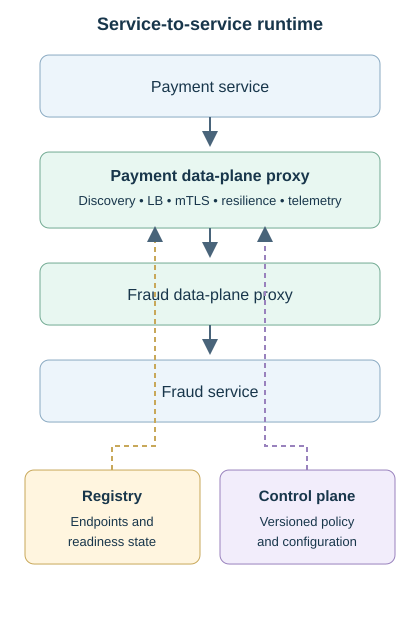
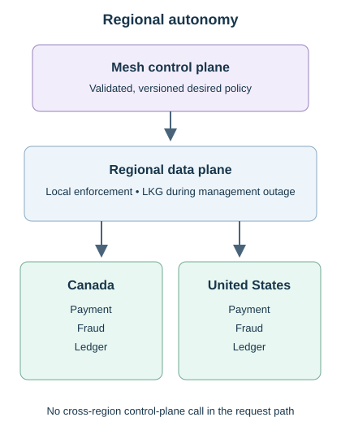
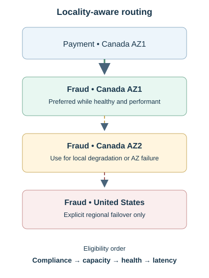
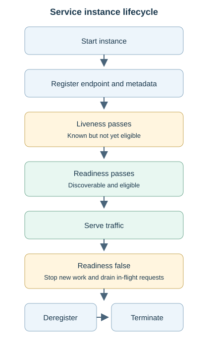
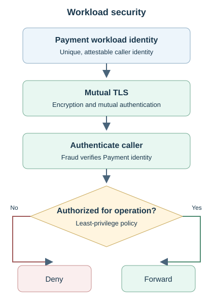
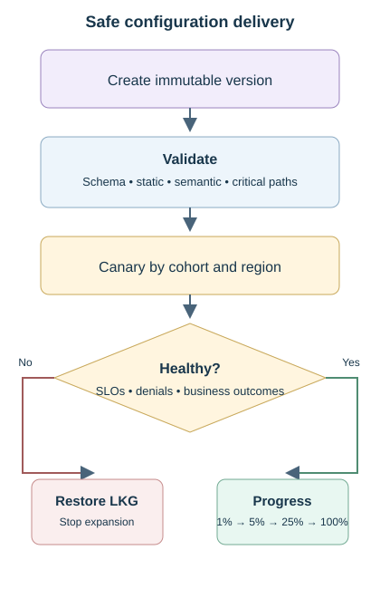
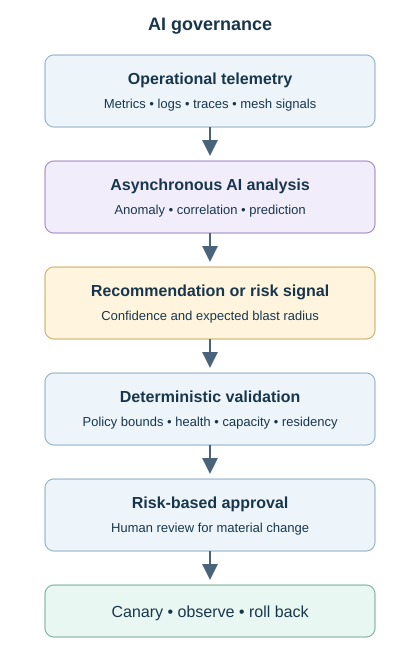
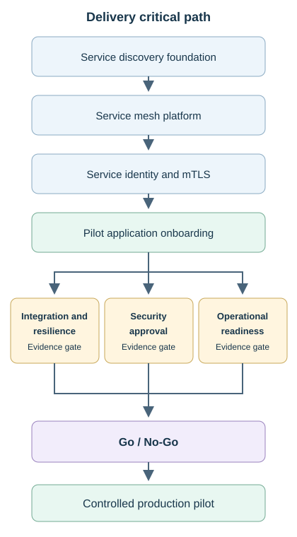

# Topic 5 — Service Mesh + Service Discovery

[Back to Architecture Drills](../Main%20Readme/README.md)

**Status:** Complete

A banking platform with 200 heterogeneous services requires dynamic endpoint discovery, internal load balancing, consistent workload security, bounded resilience, controlled traffic management, and service-to-service observability. The accepted design combines **service registry and discovery + locality-aware load balancing + distributed data-plane proxies + a versioned mesh control plane**.

Applications retain domain logic. Data-plane proxies enforce approved networking policy on live traffic. The control plane distributes desired state outside the synchronous request path, allowing regional data planes to continue with locally available last-known-good configuration during a management outage.

The mesh is justified by required cross-cutting capabilities, not service count. If standardized workload identity, mTLS, authorization, resilience, and traffic management are no longer required, service discovery and internal load balancing remain the preferred simpler design. Numerical values are architecture exercises; production thresholds, named owners, and sign-offs remain to be assigned.

## Contents

- [Problem & Requirements](#problem--requirements)
- [Final Architecture](#final-architecture)
- [End-to-End Flow](#end-to-end-flow)
- [Component Responsibilities](#component-responsibilities)
- [Key Architecture Decisions](#key-architecture-decisions)
- [Service Registry & Discovery](#service-registry--discovery)
- [Discovery Models & Internal Load Balancing](#discovery-models--internal-load-balancing)
- [Mesh Control & Data Planes](#mesh-control--data-planes)
- [Reliability & Failure Modes](#reliability--failure-modes)
- [Security](#security)
- [Configuration Safety](#configuration-safety)
- [Traffic Management](#traffic-management)
- [Observability](#observability)
- [Multi-AZ & Multi-Region](#multi-az--multi-region)
- [Constraint Mutations](#constraint-mutations)
- [Adversarial Architecture Review](#adversarial-architecture-review)
- [AI Intersection](#ai-intersection)
- [TPM Delivery](#tpm-delivery)
- [Program Risks](#program-risks)
- [TPM Constraint Mutations](#tpm-constraint-mutations)
- [Production Readiness](#production-readiness)
- [Rollout & Rollback](#rollout--rollback)
- [Concepts Learned](#concepts-learned)
- [Mental Models](#mental-models)

## Problem & Requirements

| Requirement | Decision and consequence |
|---|---|
| Dynamic endpoints | Call logical services; register changing instance endpoints and metadata instead of hard-coding addresses. |
| Safe traffic eligibility | Liveness confirms the process exists; readiness controls whether discovery may return it for production traffic. |
| Internal balancing | Select among ready endpoints using locality, load, latency, saturation, and outlier state. |
| Consistent east-west policy | Use the mesh for common identity, mTLS, authorization, resilience, routing, and telemetry. Keep business rules in applications. |
| Runtime availability | Do not query the registry or control plane for every request. Retain recent discovery state and approved policy locally. |
| Zero trust | Internal network location is not identity. Authenticate unique workloads and authorize each permitted operation. |
| Failure containment | Bound waiting, retries, connections, policy rollout, and fallback so one dependency or configuration cannot cascade. |
| Regional independence | A healthy region must continue without another region or a remote control plane. |
| Operability | Distinguish application, proxy, discovery, network, identity, authorization, control-plane, and downstream failures. |

Payment, Fraud, and Ledger illustrate the runtime path. Service instances scale, restart, reschedule, and deploy across availability zones (AZs) and regions. Exact vendors, certificate lifetimes, retry budgets, policy thresholds, SLOs, and regional data contracts remain implementation decisions.

## Final Architecture

### Service-to-service runtime

[Open the scalable runtime architecture](assets/runtime-architecture.svg)

The Payment proxy consumes discovery state, selects an eligible Fraud endpoint, establishes mTLS, applies authorization and resilience policy, and emits telemetry. The Fraud proxy authenticates and authorizes the caller before forwarding to the application.

### Regional autonomy

[Open the scalable regional autonomy diagram](assets/regional-autonomy.svg)

The control plane distributes validated, versioned desired state. Regional data planes enforce that state locally. A control-plane outage freezes management changes but does not immediately stop healthy service-to-service traffic.

### Locality and failover

[Open the scalable locality-routing diagram](assets/locality-routing.svg)

Normal routing prefers healthy, performant same-AZ capacity, then another AZ in the same region. Cross-region routing is an explicit recovery decision subject to compliance, capacity, data readiness, and dependency health.

## End-to-End Flow

1. **Register:** Fraud instances publish workload identity, endpoint, locality, version, and readiness metadata.
2. **Discover:** registry state reaches the Payment data plane without a synchronous lookup for every request.
3. **Select:** the local proxy chooses a ready endpoint using locality, load, latency, and outlier signals.
4. **Secure:** Payment presents its workload identity over mTLS; Fraud authenticates it and evaluates least-privilege authorization.
5. **Protect:** the caller deadline bounds waiting. The designated retry owner applies only safe, bounded retries with backoff, jitter, and a retry budget.
6. **Serve:** Fraud receives the request after destination-side policy enforcement.
7. **Observe:** applications and proxies emit correlated metrics, logs, traces, policy outcomes, and certificate signals.
8. **Manage:** the control plane versions, validates, distributes, and reconciles desired policy outside the request path.

## Component Responsibilities

| Component | Responsibility / boundary |
|---|---|
| Service instance or orchestrator | Register and deregister endpoint metadata; expose liveness and readiness. Discovery does not normally register instances itself. |
| Service registry | Store instance locations, readiness, locality, version, and status. Health checks, leases, and TTLs limit stale entries. |
| Service discovery | Produce the current usable endpoint set. It answers where eligible instances are. |
| Internal load balancer | Select which eligible endpoint receives a request using runtime and locality signals. |
| Application service | Own business rules, transaction semantics, idempotency, and domain authorization. |
| Data-plane proxy | Enforce live routing, mTLS, workload authorization, deadlines, delegated retries, circuit breaking, traffic splits, and telemetry. |
| Mesh control plane | Define, validate, version, distribute, and reconcile approved desired state. It does not process each service request. |
| Identity and certificate platform | Issue unique workload identities and certificates; distribute trust; renew, revoke, and monitor credentials. |
| Telemetry platform | Correlate service and proxy signals; support diagnosis, SLOs, rollout gates, and runbooks. |

## Key Architecture Decisions

| Decision / disposition | Rationale and trade-off |
|---|---|
| **Accepted:** logical service identity and dynamic discovery | Hard-coded addresses fail during scaling, restart, rescheduling, and deployment. |
| **Accepted:** server-side infrastructure for the discovery/LB-only baseline | Provides consistent behavior across Java, Go, Node.js, and Python. Client-side discovery removes an intermediary but duplicates libraries and governance. |
| **Accepted:** service mesh for the complete requirements | Standardizes identity, mTLS, authorization, resilience, traffic management, and telemetry across services. |
| **Accepted:** distributed data plane | Local proxies enforce policy. A control-plane outage differs from a local proxy failure and does not represent one central runtime hop. |
| **Accepted:** business logic remains in applications | Payment thresholds, fraud decisions, and ledger rules require domain ownership, testing, and auditability. |
| **Accepted:** one retry owner per call path | Independent client, gateway, application, and mesh retries multiply load and make deadlines difficult to reason about. |
| **Accepted:** locality while healthy and performant | Reduces latency and network cost. Runtime degradation can override locality. |
| **Accepted:** unique workload identities | Shared certificates prevent reliable caller attribution and expand compromise blast radius. |
| **Accepted:** versioned policy, regional canary, and LKG | Contains bad configuration and enables deterministic rollback and reconciliation. |
| **Rejected:** mesh selection based only on service count | Discovery, LB, basic timeout, platform TLS, and observability may be sufficient when advanced cross-cutting requirements are absent. |

## Service Registry & Discovery

[Open the scalable instance-lifecycle diagram](assets/instance-lifecycle.svg)

An instance registers before it becomes ready. Once readiness passes, discovery may return it and the balancing layer may select it. Planned shutdown reverses the sequence: mark not ready, stop new traffic, drain in-flight requests, deregister, then terminate.

A crashed process cannot deregister itself. External health checks, heartbeats or leases, and TTL expiry must eventually remove it from the eligible set. Passive connection failures can accelerate avoidance while registry state converges.

A slow instance that still returns HTTP 200 may remain registered but lose normal traffic through latency-aware balancing or outlier ejection. Registered, alive, ready, and performant are separate states.

During a registry outage, existing calls continue from recent discovery state. New instances may start but remain unavailable to callers, so new compute does not become usable capacity. Monitor state age, stale endpoints, and reconciliation after recovery.

## Discovery Models & Internal Load Balancing

| Model | Use and trade-off |
|---|---|
| Client-side discovery | Client obtains endpoints and selects directly. Avoids an intermediary but couples every language/runtime to discovery and balancing behavior. |
| Server-side discovery | Client calls a stable service abstraction; infrastructure discovers and selects an endpoint. Simplifies clients but adds infrastructure that must scale and remain available. |
| Mesh proxy selection | Local proxy combines discovery and load balancing with security, resilience, routing, and telemetry. Adds runtime and operational cost. |

Discovery answers **which usable endpoints exist**. Internal load balancing answers **which one receives this request**. Round robin is simple; least requests or concurrency-aware selection better reflects unequal work. Connection count alone may misrepresent load under pooled or multiplexed protocols.

Locality normally follows **same AZ → same region/different AZ → another region when explicitly approved**. Locality is a preference, not permission to continue routing to a slow or saturated endpoint.

## Mesh Control & Data Planes

| Capability | Definition and runtime placement |
|---|---|
| Workload identity and mTLS | Control plane distributes identity/trust configuration; data plane presents and verifies identity and establishes encrypted mutual authentication. |
| Authorization | Control plane distributes policy; destination data plane enforces it on live requests. |
| Deadlines, retries, circuit breakers | Control plane distributes approved values; data plane executes the behavior. |
| Traffic splitting | Control plane defines versions and weights; data plane routes the actual traffic share. |
| Telemetry | Control plane configures collection and propagation; data plane generates runtime signals. |

The control plane defines and distributes desired state. The data plane enforces it. During a control-plane outage, current traffic continues with locally available approved policy and discovery state. New changes pause, drift becomes observable, and reconnecting proxies reconcile to the declared approved version.

Last-known-good state protects availability but has limits. Cached configuration does not extend certificate validity or guarantee that stale authorization remains safe after a critical security change.

## Reliability & Failure Modes

| Failure | Containment and recovery |
|---|---|
| Slow Fraud dependency | Stop at the caller deadline. Retry only safe failures under one owner, a total deadline, bounded attempts, backoff, jitter, and a retry budget. |
| Persistent dependency failure | Open the circuit and fail fast; use a limited half-open probe to test recovery. |
| One slow but ready endpoint | Reduce traffic or eject the outlier; investigate CPU, memory, runtime pauses, connection pools, network, and downstream latency. |
| Registry outage | Continue existing traffic from recent endpoints; freeze topology-dependent changes and reconcile after recovery. |
| Stale endpoint | Use health, lease/TTL, passive failures, and bounded connection timeouts to stop selection. |
| Control-plane outage | Continue with safe LKG policy; freeze rollout. Apply predefined security semantics when stale policy becomes unsafe. |
| Local proxy failure | Isolate and repair the affected workload; other proxies continue. |
| Partial certificate expiry | Remove affected workloads from eligible traffic. Continue on valid capacity only when it has sufficient headroom. |
| Retry amplification | Remove retries from competing layers. Four layers with three attempts each can produce up to 81 downstream attempts. |
| AZ loss | Use pre-sized survivor capacity, admission controls, and priority shedding. Autoscaling does not provide instant failure capacity. |

Circuit state and business failure policy are different. Circuit **OPEN** stops dependency calls. For a high-value payment that requires Fraud approval, business behavior should **fail closed** by rejecting, holding, or routing to manual review rather than interpreting unavailability as approval.

## Security

[Open the scalable workload-security diagram](assets/workload-security.svg)

- **Workload identity:** establishes which service is calling, independent of its IP address.
- **mTLS:** encrypts the connection and mutually authenticates both workloads; it does not grant an operation.
- **Authorization:** determines what the authenticated workload may do.
- **Least privilege:** grants only required service operations. A valid Notification identity does not permit ledger posting.
- **Domain authorization:** remains in the application when the decision depends on transaction, account, customer, or business state.

### Certificate lifecycle

Issue certificates early, install them on a limited cohort, validate mTLS, rotate progressively with old/new overlap, confirm fleet health, and retire the old certificate only after successful adoption. Monitor issuance, installation, expiry margin, rotation failure, trust-bundle version, and workloads still presenting old credentials.

If an old certificate has already expired, overlap is no longer a recovery mechanism. Remove the workload, repair or reissue its identity, validate it, and return it to service only when secure and ready. Do not weaken mTLS platform-wide to preserve a failing cohort.

## Configuration Safety

[Open the scalable configuration-safety diagram](assets/configuration-safety.svg)

Use immutable, explicitly versioned configuration for deterministic rollback, auditability, drift detection, and reconciliation. Validation must cover schema, static references, semantic policy, and critical allowed paths such as Payment → Ledger. Valid syntax alone cannot establish operational safety.

Deploy first to a bounded service cohort and one region. Observe authorization denials, customer operations, latency, errors, retries, saturation, and dependencies before progressive expansion. Restore the versioned LKG state when a gate fails.

If control-plane failure interrupts a partial rollout, freeze the rollout and let proxies use their current valid version when policy semantics permit. After recovery, confirm the approved desired version before reconciliation. A critical security exposure may require an emergency path or fail-closed behavior for affected operations.

## Traffic Management

| Technique | Use and safety boundary |
|---|---|
| Canary | Move a small share progressively, for example 1% → 5% → 20% → 50% → 100%, with predefined gates at each step. |
| Blue/green | Validate a complete inactive environment, then switch production traffic. Keep the prior environment compatible and available for rapid rollback. |
| Weighted and version routing | Send an explicit share to a service version; scope by service, cohort, and region and verify capacity. |
| Traffic shadowing | Copy production requests to a candidate and ignore its response. Suppress side effects and never duplicate a banking write. |

Fraud v2 at p99 280 ms against a 200 ms service SLO fails its rollout gate even if 5xx and business results remain normal. Roll back, diagnose, fix, and canary again.

At 20%, p99 190 ms, retries three times normal, CPU at 85% and rising, and additional downstream calls require a pause. Current SLO compliance does not override a clear saturation trend.

## Observability

| Signals | What they reveal |
|---|---|
| Request rate, p50/p95/p99, errors, timeouts, retries, breaker and outlier events | Service health, tail regression, amplification, and resilience actions. |
| Proxy latency, connections, pools, queues, CPU/memory, response flags | Whether a failure sits in the application, proxy, network, or dependency. |
| Discovery version/age, endpoint count, registration and readiness changes | Stale topology, slow convergence, or unusable new capacity. |
| mTLS failures, authorization denials, certificate expiry/rotation, trust version | Identity, policy, and credential failures. |
| Configuration version, drift, rollout cohort, regional propagation | Unsafe rollout, inconsistent enforcement, or stalled reconciliation. |
| End-to-end traces and dependency maps | Time and failure location across Payment → proxies → Fraud → Ledger. |
| Business outcomes, SLOs, and error-budget burn | Customer impact that infrastructure health alone may hide. |

Metrics indicate whether something is wrong. Logs explain what happened within a component. Traces locate time and failure across the distributed request. Propagate trace and request identifiers across applications and proxies.

Dashboards, alerts, and runbooks must enable L1/L2 support to distinguish application, proxy, discovery, network, identity/certificate, authorization, control-plane, and downstream faults. Introducing another runtime layer also creates an obligation to make that layer diagnosable.

## Multi-AZ & Multi-Region

Prefer same-AZ endpoints while they are healthy and performant. When local latency or saturation degrades, route to another AZ in the same region before considering cross-region traffic. Test cross-AZ connectivity with synthetic probes and controlled failure exercises rather than forcing every normal request across zones.

Two AZs each operating at 60% cannot absorb all traffic after one AZ fails; the survivor would require approximately 120% of its capacity. Design N+1 headroom before failure, apply concurrency/admission controls, and shed or degrade lower-priority work to protect critical transaction traffic.

Normal Canadian transactions use Canadian Payment, Fraud, and Ledger capacity. A synchronous US Fraud dependency adds cross-region latency, cost, data-residency concerns, and failure propagation. Cross-region routing requires an explicit decision supported by compliance, safe capacity, identity/certificates, data readiness, and downstream health.

## Constraint Mutations

| Changed constraint | Accepted response and correction |
|---|---|
| **200 → 2,000 services** | Scale registry leases/writes, discovery fan-out, control-plane distribution, certificate operations, and telemetry horizontally. Measure the actual bottleneck before redesign. |
| **Fraud 10 → 500 instances in 30 seconds** | Make registration, readiness, discovery propagation, proxy convergence, and load-balancer adoption fast enough for compute to become usable capacity. |
| Registry unavailable for 10 minutes | Continue on recent endpoints. New instances may remain unusable until recovery and reconciliation. |
| Stale crashed endpoint | Detect through health, lease/TTL, connection failure, and passive signals. A crashed process cannot deregister or self-degrade. |
| Control plane unavailable for one hour | Continue existing traffic with safe LKG state; freeze changes. Use explicit security semantics for newly unsafe stale policy. |
| Certificate rotation fails for 10% | Isolate expired workloads and prove the valid fleet has capacity. Do not weaken mTLS or expand the failing cohort. |
| Four layers retry three times | Assign one retry owner and bound attempts, time, budget, and idempotency. Worst case is 81 attempts, not 12. |
| AZ1 fails while both AZs run at 60% | Use preplanned headroom, admission controls, and priority shedding. Blind failover can cascade into AZ2. |
| Bad authorization policy has global scope | Use semantic tests, regional canary, progressive rollout, and versioned LKG. Avoid simultaneous global deployment. |
| One endpoint has p99 4 seconds; peers have 100 ms | Use latency-aware routing and outlier ejection; investigate the endpoint rather than treating HTTP 200 as sufficient health. |

## Adversarial Architecture Review

| Challenge | Outcome retained |
|---|---|
| Why introduce a mesh for 200 services? | Keep it only when cross-cutting identity, authorization, resilience, routing, and telemetry justify the runtime and operational cost. |
| Why not configure retries in Payment and the mesh? | Independent layers create conflicting deadlines and multiplicative retries. Establish one owner based on operation semantics. |
| Why not set timeout to 100 ms when Fraud p99 is 180 ms? | The timeout would convert normal tail latency into false failures and retry load. Derive it from the caller budget and measured distribution. |
| Why not put enhanced screening rules in the proxy? | Payment thresholds and screening decisions are business/domain logic, not networking policy. |
| Can the mesh replace API-gateway controls? | No. Gateway controls north-south API entry; mesh controls east-west workload communication. |
| Should every AZ1 request use AZ2 to exercise resilience? | No. Prefer local healthy capacity and test failover through probes and controlled exercises. |
| Are extremely short certificate lifetimes always safer? | No. Shorter exposure increases rotation dependency. Rotate early with overlap, monitoring, and recovery margin. |
| Should the mesh remain if advanced requirements disappear? | No. Remove complexity that no longer earns its operational cost. |

## AI Intersection

[Open the scalable AI-governance diagram](assets/ai-governance.svg)

Accepted uses are asynchronous anomaly detection, correlation, and prediction: emerging retry storms, saturation, clustered certificate-rotation failures, abnormal dependency behavior, and forecast error-budget exhaustion. Deterministic monitoring already calculates latency, errors, and current error budgets.

AI remains outside the synchronous Payment request path. Per-request AI endpoint selection would add latency, nondeterminism, model availability, cost, audit difficulty, and unnecessary blast radius where deterministic health, latency, and outlier signals already work.

Production recommendations pass deterministic validation, architecture and engineering review, performance/resilience testing, risk-appropriate approval, canary rollout, observation, and rollback. Low-risk, bounded, reversible actions may be automated only within preapproved guardrails.

## TPM Delivery

| Outcome-based workstream | Completion evidence |
|---|---|
| Service Discovery Foundation | Registry lifecycle, readiness, discovery convergence, internal LB, and registry-failure behavior. |
| Service Mesh Platform | Regional control/data planes, policy distribution, versioning, LKG operation, drift reconciliation, and scale. |
| Service Identity & mTLS | Unique identity, trust, authorization, issuance, rotation overlap, revocation, expiry monitoring, and recovery. |
| Resilience Standardization | Retry ownership, deadlines, budgets, circuit breakers, outliers, connection pools, and failure semantics. |
| Traffic Management | Canary, blue/green, weighted routing, safe shadowing, rollout gates, and rollback. |
| Observability | Correlated telemetry, dependency maps, SLOs, dashboards, alerts, runbooks, and fault isolation. |
| Application Onboarding | Dependency maps, policies, compatibility, ownership, test evidence, and controlled waves. |
| Multi-AZ / Multi-Region | Locality, failure capacity, regional autonomy, policy boundaries, and resilience exercises. |
| Operational Readiness | L1/L2/L3 walkthrough, RACI, escalation, hypercare/on-call, security/MOR approval, and incident simulation. |

### Critical path

[Open the scalable delivery critical path](assets/delivery-critical-path.svg)

The pilot dependency sequence is **discovery foundation → mesh platform → service identity and mTLS → pilot onboarding → integration/resilience, security approval, and operational readiness → Go/No-Go**.

Security architecture, application assessment, dependency mapping, observability, test design, runbooks, manifests, and lower-environment preparation start before final integration. If the mesh platform slips six weeks, dependent teams continue this preparatory work; final mesh validation, certification, and production onboarding wait for platform readiness.

## Program Risks

| Risk / owner function | Mitigation → trigger → contingency |
|---|---|
| Certificate rotation fails for 5% / Identity + Platform | Root-cause and retest issuance → installation → overlap → retirement → success below the agreed threshold or expiry margin → pause cohort, retain valid overlap, emergency reissue, isolate expired workloads. |
| Discovery convergence lags autoscaling / Discovery Platform | Load-test registration churn and define a propagation SLO → usable capacity trails compute → preserve headroom, throttle, or prioritize admission. |
| Bad mesh policy has global blast radius / Mesh + SRE | Semantic tests, regional/cohort canary, immutable versions → denials or customer regression → freeze expansion and restore LKG. |
| Retries overload a degraded dependency / Service Owner + SRE | One retry owner, safe-operation catalogue, deadlines and budgets → retry/error/saturation rise → disable retry policy or open circuit. |
| AZ survivor lacks failure capacity / Capacity + SRE | Prove N+1 capacity and loss behavior → projected or actual unsafe saturation → shed lower-priority work and protect critical traffic. |
| Platform delay blocks onboarding / TPM + Platform | Track required-by dates and prepare applications in parallel → latest safe integration date missed → phase scope or rebaseline waves. |
| Mesh remains difficult to diagnose / SRE + Platform | Layer-specific telemetry, runbooks and simulation → support cannot isolate a representative fault → delay pilot. |

Certificate rotation failure at 5% is a reproducible high-impact issue, not a medium residual risk. Mitigation reduces probability or impact before occurrence; contingency executes after the trigger. An undefined fix-forward approach is not a valid contingency for a security-critical control.

## TPM Constraint Mutations

Delivery implications of the completed architecture decisions:

| Constraint | Delivery response |
|---|---|
| 200 services required in four rather than eight months | Deliver the platform and a representative lower-risk subset in four months; complete remaining waves by month eight. Trade scope for time rather than removing controls. |
| Schedule compression | Parallelize assessment, configuration preparation, observability, security review, runbooks, environments, and later waves. Preserve identity, resilience/performance, InfoSec, readiness, and rollback gates. |
| Mesh platform slips six weeks | Continue work that does not require the production-ready platform; defer final integration, mTLS validation, mesh testing, certification, and production onboarding. |
| Pilot is 48 hours away and troubleshooting is weak | Conditional Go only if walkthrough, RACI/escalation, hypercare, dashboards, alerts, and incident simulation close before the decision point; otherwise delay. |

## Production Readiness

Required gates, **not claims of passed tests**. Each needs objective acceptance criteria, a named owner, evidence, and sign-off.

| Gate | Evidence before Go |
|---|---|
| Contracts and correctness | Unit/component and policy tests for identity, routing, authorization, deadlines, retry ownership, errors, and business semantics. |
| End-to-end integration | Payment → Fraud → Ledger works with correct authn/authz, policy enforcement, telemetry, and business result. |
| Performance and capacity | Proxy overhead, p99, pools, registry/control-plane scale, churn, telemetry volume, and downstream ceilings. |
| Discovery failure | Registry outage, stale endpoint removal, readiness/draining, rapid-scale convergence, and recovery reconciliation. |
| Resilience | Deadlines, safe retries, budgets, backoff/jitter, circuit states, outliers, and retry-storm containment. |
| Control/configuration | One-hour outage, LKG safety, drift reconciliation, invalid-policy rejection, canary, rollback, and regional containment. |
| Security | Unique identity, mTLS, least privilege, authorization, certificate rotation/expiry/revocation, and InfoSec approval. |
| AZ/region | Locality, survivor capacity, admission/shedding, regional autonomy, partitions, and approved failover behavior. |
| Observability and operations | Layer-specific dashboards/alerts, SLOs, runbooks, incident simulation, L1/L2/L3 walkthrough, on-call, escalation, and MOR. |
| Release and rollback | Tested application/configuration/traffic rollback, owners, thresholds, communication, and residual-risk acceptance. |

Conditional Go is valid only when every mandatory condition closes before the decision point. If support cannot diagnose application, proxy, discovery, certificate/authentication, policy, or downstream failures using the actual tooling and runbooks, the pilot is No-Go.

## Rollout & Rollback

Use **lower environment → representative lower-risk pilot → 1% → 5% → 20/25% → 50% → 100%**, with explicit observation and approval before each increase. Expand one bounded cohort or region at a time and preserve a versioned known-good state.

Block invalid policy before rollout. Freeze and restore LKG on SLO, error, or authorization regression. Pause on rising retries, saturation, or downstream work even before a formal SLO breach. Stop a certificate cohort that misses its success threshold; retain valid overlap where possible and isolate/reissue expired workloads. Reconcile discovery and configuration drift only to the explicitly approved desired state.

Application rollback, mesh-policy rollback, certificate/trust recovery, and traffic failback are separate operations. Shadow requests must suppress side effects. Blue/green rollback remains safe only while the prior environment and its data/contracts remain compatible.

## Concepts Learned

| Concept | Working meaning / correction |
|---|---|
| Registry / discovery / internal LB | Store instance state / find usable endpoints / select one endpoint. |
| Liveness / readiness | Process alive / safe to receive production traffic. |
| Graceful deregistration / degradation | Drain and leave the pool cleanly / continue with reduced capability. |
| Client-side / server-side discovery | Client selects an endpoint / infrastructure selects it. |
| Control plane / data plane | Define and distribute desired state / enforce it on live traffic. |
| Workload identity / mTLS / authorization | Establish caller / authenticate and encrypt / determine permitted operations. |
| Circuit OPEN / fail closed | Stop dependency calls / deny or hold a business operation without required assurance. |
| Retry budget | Bound aggregate retry traffic, not only attempts per request. |
| Outlier / service failure | One abnormal endpoint / dependency-wide failure. |
| LKG / safe stale policy | Preserve serving / only while credentials and policy semantics remain acceptable. |
| SLO / error budget | Reliability target / allowed miss over its measurement window. |
| Canary / blue-green / shadow | Progressive exposure / environment switch / non-authoritative copied traffic. |

## Mental Models

- Discovery answers **where**; load balancing answers **which endpoint**; the mesh governs **how service traffic behaves**.
- Application owns domain logic; control plane owns desired policy; data plane owns runtime enforcement.
- Registered, alive, ready, and performant are different states.
- Registry and control plane update local state; neither should be a per-request dependency.
- Locality is a preference while the endpoint remains healthy and performant.
- Retry at one layer that understands operation semantics; retries multiply across layers.
- Circuit OPEN stops calls; fail closed blocks a business action without required assurance.
- mTLS authenticates and protects identity in transit; authorization grants operations.
- LKG cannot extend expired credentials or make newly unsafe policy safe.
- Capacity planning uses the capacity left after failure, not before it.
- Mesh adoption follows cross-cutting requirements, not microservice count.
- AI predicts and recommends asynchronously; deterministic controls own live requests and production changes.
- Production readiness requires evidence that people can detect, diagnose, contain, recover, and roll back failures.

---

**Design basis:** completed Topic 5 Service Mesh + Service Discovery drill, including accepted/refined/rejected proposals, failure analysis, constraint mutations, AI boundary, TPM delivery, and production readiness. Implementation safeguards make the decisions explicit without claiming certification. Previous: [Topic 4 — API Gateway + Global Load Balancing](../04-api-gateway-global-load-balancing/README.md). Next: [Topic 6 — Distributed Cache](../06-distributed-cache/README.md).
