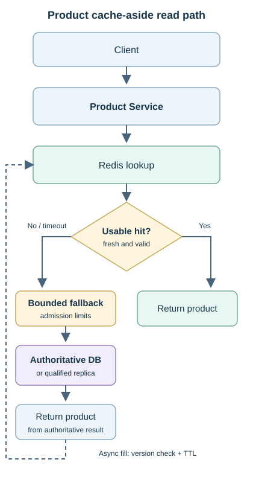
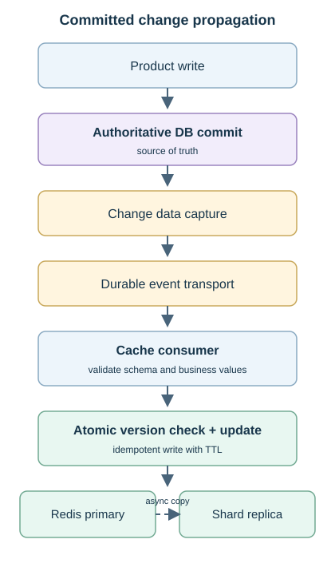
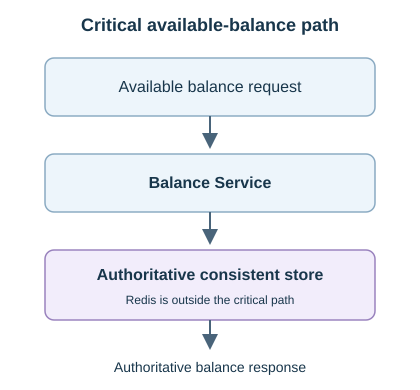
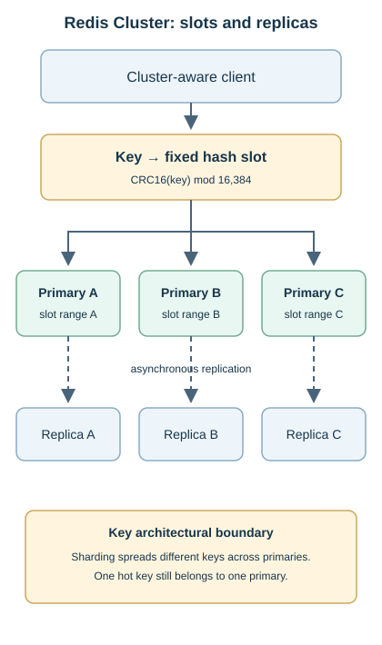
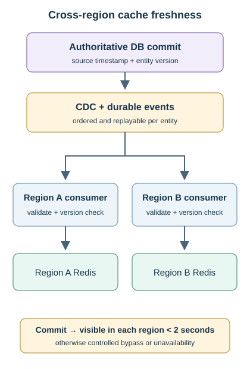

# Topic 6 — Distributed Cache

[Back to Architecture Drills](../README.md)

**Status:** Complete

A read-heavy banking platform uses Redis to reduce lookup latency and database load for product/reference data. The accepted design combines **cache-aside reads + asynchronous miss population + DB commit → CDC → event → cache consumer → Redis updates**. Redis Cluster distributes keys across primaries, with replicas for failover and optional freshness-qualified reads.

**The database remains the authoritative source of truth.** Product data may tolerate bounded eventual consistency; Redis stays outside the critical available-balance path. Drill completion records architecture decisions, not production certification. Except for the cross-region freshness requirement below, numerical examples are exercises; implementation thresholds, owners, and sign-offs remain to be assigned.

## Contents

- [Problem & Requirements](#problem--requirements)
- [Final Architecture](#final-architecture)
- [End-to-End Flow](#end-to-end-flow)
- [Component Responsibilities](#component-responsibilities)
- [Key Architecture Decisions](#key-architecture-decisions)
- [Cache Patterns](#cache-patterns)
- [Data & Consistency](#data--consistency)
- [Scaling](#scaling)
- [Reliability & Failure Modes](#reliability--failure-modes)
- [Security](#security)
- [Observability](#observability)
- [Constraint Mutations](#constraint-mutations)
- [Adversarial Architecture Review](#adversarial-architecture-review)
- [AI Intersection](#ai-intersection)
- [TPM Delivery](#tpm-delivery)
- [Program Risks](#program-risks)
- [TPM Constraint Mutations](#tpm-constraint-mutations)
- [Production Readiness](#production-readiness)
- [Rollout & Rollback](#rollout--rollback)
- [Concepts Learned](#concepts-learned)
- [Mental Models](#mental-models)

## Problem & Requirements

| Data / requirement | Decision and consequence |
|---|---|
| Product catalogue, branch/reference data | Good cache candidates when the business accepts a defined stale window. |
| Customer profile, transaction history | Conditional: field sensitivity, new postings/reversals, access control, and freshness matter. |
| Fraud/authorization configuration | Strict freshness and failure policy; never assume stale rules are safe. |
| Available balance | Read the authoritative strongly consistent store; exclude Redis from critical reads and decisions. |
| Latency and throughput | Improve tail latency and reduce DB reads without hiding an unsafe fallback capacity gap. |
| Freshness | Define per data class; the two-region mutation requires changes to become visible in **less than 2 seconds**. |
| Resilience | Bound cache waiting, fallback concurrency, retries, and recovery load. |
| Operability | Measure each shard, replication, CDC/consumer lag, freshness, and DB impact. |

At 20,000 requests/second and 95% hits, approximately **1,000 reads/second** miss, not 19,000. At one million requests/second, even 99% hits can leave 10,000 misses/second. These estimates exclude refreshes, retries, and request coalescing. A stale entry can still be a cache hit.

## Final Architecture

### Product read path

[Open the scalable product read-path diagram](assets/product-read-path.svg)

“Usable” includes freshness and schema checks. The service owns DB access; Redis does not load missing products itself. The DB response can reach the client before cache population finishes.

### Committed change propagation

[Open the scalable change-propagation diagram](assets/committed-change-propagation.svg)

The consumer, not Redis Cluster, subscribes to events. Updating a complete product projection is the selected path; invalidation remains appropriate when an event cannot safely reconstruct it.

### Critical balance boundary

[Open the scalable balance-boundary diagram](assets/critical-balance-boundary.svg)

Money-movement correctness also requires authoritative transactional checks; a prior balance read is not a reservation of funds.

## End-to-End Flow

1. **Hit:** Product Service uses a cluster-aware client to find the key's slot owner; return the value only while the freshness policy permits it.
2. **Miss:** admit a bounded DB/read-replica request, obtain the product and source version, return it, and populate Redis asynchronously. Coalesce hot-key misses; a failed background fill causes another miss, not loss of authoritative data.
3. **Write:** Product Service commits to DB. CDC captures that committed change, event transport distributes it, and the cache consumer validates and conditionally updates Redis with a TTL.
4. **Primary failure:** detect failure, promote an eligible replica, refresh client topology, and resume slot routing. Promotion may expose an older value; contain stale reads and repair from DB or replay.
5. **Recovery:** verify pipeline progress and freshness before restoring normal traffic; warm gradually under DB and cache budgets.

## Component Responsibilities

| Component | Responsibility / boundary |
|---|---|
| Product Service | Business writes, cache reads, miss handling, bounded fallback, asynchronous fills. |
| Authoritative DB | Durable committed product state and source versions; owns correctness. |
| DB read replica | Optional read offload only when replication lag fits the freshness budget. |
| CDC | Capture committed changes; recover from durable positions within log retention. |
| Event transport | Durable delivery, replay, ordering scope, retention, and backpressure. |
| Cache consumer | Validate schema/domain values; apply idempotent, version-guarded updates and deletes. |
| Cluster-aware client | Map key → slot → owner; handle topology changes and redirects. |
| Redis primaries / replicas | Partition cache state / copy shard state for failover and optional reads. |
| Operations | Detect degradation, enforce fallback limits, reconcile, recover, and own runbooks. |

## Key Architecture Decisions

| Decision / disposition | Why and trade-off |
|---|---|
| **Accepted:** cache-aside reads | Service controls source access and fallback; more application logic. |
| **Accepted:** async miss population | Client need not wait for Redis write; concurrent misses and stale-fill races need controls. |
| **Accepted:** CDC-driven cache updates | Survives application crash after DB commit, provided capture/replay remains recoverable. |
| **Refined:** update instead of invalidate-only | Complete price events can replace values directly; complex projections may need reload/invalidation. |
| **Accepted:** bounded eventual consistency | Appropriate for approved product/reference views, not critical available balance. |
| **Accepted:** versions, idempotency, TTL | Handle reordering, duplicates, and missed propagation; none makes DB and Redis one transaction. |
| **Accepted:** primaries plus replicas | Sharding adds aggregate capacity; replication adds resilience, with lag. |
| **Rejected:** arbitrary DB/cache dual writes | DB success/cache failure leaves stale state; cache success/DB failure exposes uncommitted state. |
| **Rejected:** write-behind financial authority | Acknowledging before DB persistence risks losing accepted financial changes. |
| **Rejected:** TTL removal or unlimited DB bypass | Failed propagation can leave persistent stale data; uncontrolled fallback can collapse DB. |
| **Rejected:** AI routing or consistency authority | Deterministic placement and correctness rules remain outside AI. |

## Cache Patterns

| Pattern | Meaning / use in this design |
|---|---|
| Cache-aside / lazy loading | Service loads missing data from DB; selected, with async population. |
| Read-through | A caching abstraction owns the loader; Redis alone does not supply that DB integration. |
| Write-through | Backing-store persistence is synchronous before success; cross-store failure handling is still required. |
| Write-behind / write-back | Cache accepts first; DB persists later. Rejected for authoritative financial state. |
| Refresh-ahead | Refresh likely hot entries before expiry, within source-load and freshness limits. |
| Event update / invalidation | Replace a complete valid projection / remove an uncertain projection and reload later. |
| Local cache | Avoids a network hop for safe hot reads; each instance has its own cold-start and freshness problem. |

DB-first asynchronous cache propagation is **not write-behind**. Async miss population solves response latency; CDC solves propagation of subsequent committed changes.

## Data & Consistency

**Update contract.** Carry stable entity ID, source version/sequence, operation, schema version, and sufficient data or a reload instruction. Validate values before writing. Apply comparison and replacement atomically per key: older versions cannot replace newer ones, and duplicate delivery is harmless. Advance processing checkpoints only after successful handling; use bounded retry and a dead-letter queue (DLQ) with owned replay for rejected events.

**Race to prevent.** A miss reads version 10; CDC installs version 11; the delayed async fill must not overwrite it with version 10. Apply the same version guard to both writers. Deletion requires versioned tombstones or equivalent fencing so delayed fills/events cannot resurrect deleted products. If eviction, expiry, or failover removes the version guard, comparison alone is insufficient: bound fill/replay age and re-read the authoritative source or retain a durable version fence before accepting uncertain state. These are implementation requirements, not guarantees of a plain cache write.

**TTL is a safety net.** Time to live bounds an entry's residence, not automatically its age relative to DB. Lagging replicas, old replay, or repeatedly resetting TTL on stale data can prolong staleness. Preserve source-version/freshness evidence, cap fill age, and avoid duplicate events extending stale lifetimes. Select TTL and jitter within the business freshness limit; never extend TTL merely to hide capacity pressure.

**Authority and freshness differ.** DB remains authoritative even when product clients may briefly see older data. A Redis update can be atomic locally while the DB → event → cache flow remains eventual. Product display tolerance does not authorize stale pricing or balance decisions at transaction commit.

## Scaling

Redis Cluster uses **16,384 fixed hash slots**: `CRC16(key) % 16384`, with hash-tag handling when present. A key maps to a slot; the cluster-aware client routes to its current primary. Rebalancing moves slots and their keys, without changing the fixed key-to-slot function. This differs from a classic consistent-hashing ring and from `hash(key) % node_count`. [Redis Cluster specification](https://redis.io/docs/latest/operate/oss_and_stack/reference/cluster-spec/).

[Open the scalable Redis Cluster diagram](assets/redis-cluster-slots.svg)

- **Sharding:** split keys, memory, and aggregate load. A single hot key still belongs to one primary.
- **Replication:** copy the same shard for failover and optional read offload; does not distribute primary writes or guarantee zero lag.
- **Hot keys:** use bounded local caching, eligible replica reads, coalescing, refresh-ahead, and admission control. Deliberate duplicate keys add update/freshness complexity.
- **Multi-key operations:** colocate only where needed, e.g. `account:{123}:profile` and `account:{123}:preferences`. Excessive hash-tag colocation creates hot slots; cross-slot operations cannot be assumed atomic.

### Memory and eviction

For disposable product data, prefer **allkeys-LRU** for recency or **allkeys-LFU** for sustained frequency/skew; validate against the workload. Volatile variants consider only TTL-bearing keys. Shortest-TTL eviction can discard a hot value and is a separate policy, not an extra LRU/LFU rule. Redis uses approximate LRU/LFU algorithms. Eviction responds to the configured memory limit; TTL expiration is independent. Reserve headroom for buffers and overhead and alert before exhaustion. [Redis eviction policies](https://redis.io/docs/latest/develop/reference/eviction/).

## Reliability & Failure Modes

| Failure | Containment and recovery |
|---|---|
| Stampede: many misses for one key | Single-flight or short leased refresh lock with safe release; bounded waits and DB concurrency. |
| Avalanche: many keys expire or cache capacity disappears | TTL jitter, gradual warming, refresh budgets, admission control. |
| Penetration: nonexistent-key reads reach DB repeatedly | Validate requests; short negative-cache TTL, rate limits, invalidate/replace on creation. Never cache DB errors as NOT_FOUND. |
| Hot key despite near-100% hits | Inspect per-key/shard CPU, network, latency; offload safe reads and reduce demand. |
| Slow/unreachable Redis | Short timeout, circuit breaker, bounded retries, controlled DB fallback. |
| CDC/consumer stalls | Alert on pipeline progress and freshness; bypass affected data under DB limits; replay/reconcile. |
| Primary loss / stale promoted replica | Refresh topology, assess lag, bypass or invalidate affected state, rebuild from DB/events. |
| Partial shard loss | Prefer affected-slot degradation where cluster availability policy permits; protect fallback capacity. |
| Network partition / competing ownership | Use cluster failover/quorum rules; do not manually admit competing primaries; reconcile to DB after recovery. |
| DB unavailable | Serve only cache values permitted by the freshness policy; otherwise return controlled unavailability. |
| Malformed or poisoned event | Schema/domain validation, least-privilege writes, DLQ, investigation and repair. |

**Partial availability is conditional.** Redis can stop serving more broadly when full slot coverage or quorum is lost. The drill's desired isolation of affected slots must be proved with the selected configuration and failure tests; it is not automatic. Asynchronous replication also allows recent cache writes to be lost during failover. [Redis scaling and availability](https://redis.io/docs/latest/operate/oss_and_stack/management/scaling/).

Fallback limits must protect the **whole DB fleet**, not just each application instance. Read replicas need spare capacity and acceptable lag. Shed/degrade lower-priority traffic when limits are exhausted. For critical security decisions, lack of trustworthy state can require denying or holding the operation instead of serving stale data.

## Security

Use TLS, authenticated workload identities, least-privilege ACLs, network isolation, managed secrets and rotation. Only authorized consumers and service population paths may write their key namespaces; separate administration from runtime access. Validate event origin, schema, key construction, and business values to prevent poisoning or tenant mixing. Minimize PII, secure persistence/backups where enabled, redact logs, audit administrative changes, and enforce regional residency requirements.

## Observability

| Signals | What they reveal |
|---|---|
| Hit/miss by tier, shard, key class; absolute request rate | Cache effectiveness and actual DB demand. |
| p95/p99, timeouts/errors, connections, CPU/network per node | Hot shards and latency hidden by cluster averages. |
| Memory/headroom, evictions, expirations, key sizes | Capacity pressure versus normal TTL behavior. |
| Replication lag, slot coverage, failover duration, redirects | Recovery gaps and routing instability. |
| CDC position, backlog, oldest unprocessed change, update failures/DLQ | Propagation delay and stalled processing. |
| Commit-to-visible delay by region, sampled source comparisons | Freshness independent of hit ratio. |
| DB/replica latency, lag, saturation, fallback/rejection rate | Whether cache degradation is becoming a database incident. |

Use heartbeats or source watermarks to distinguish an idle product stream from a broken pipeline. An old last-change timestamp alone does not prove staleness. Connect alerts to owners, thresholds, and runbooks; 99% hits do not prove fresh data or healthy shards.

## Constraint Mutations

| Changed constraint | Accepted response / correction |
|---|---|
| **10× traffic; no new nodes for 30 days** | Diagnose and rebalance uneven slots, then reduce demand with safe local caching, coalescing, refresh-ahead, bounded replica reads, rate limits and degradation. Rebalancing cannot create aggregate capacity or split one hot key. |
| Primary fails with replica behind | Promote, refresh topology, contain stale reads, replay/reload; availability is not freshness. |
| Entire cache fails / DB already busy | Enforce DB budgets, prioritize work, shed excess; never redirect the entire cache load blindly. |
| Business demands zero stale data | Revisit the read architecture and authoritative store; shorter TTL or faster CDC does not prove strong consistency. |
| **Two regions; freshness under 2 seconds** | Regional consumers update regional caches from committed changes; monitor end-to-end visibility and bypass when freshness cannot be established. |

[Open the scalable cross-region freshness diagram](assets/cross-region-freshness.svg)

For the two-region mutation, budget **capture + transport + queueing + apply + any replica/local-cache delay** below two seconds. Use per-entity versions and verify both regions, including failure recovery. TTL alone is insufficient. If freshness is unknown or breaches the bound, use a qualified source under admission limits; if no source meets the requirement, return controlled unavailability. A partition cannot guarantee both fresh reads and uninterrupted serving. Regional ownership, residency, and exact measurement/alert margins must be finalized before launch.

## Adversarial Architecture Review

| Challenge | Outcome retained |
|---|---|
| Why Redis at all? | Keep it only where measured latency/load gains justify operational cost. Stable small reference data may need only local caching. |
| Why not use fast, highly available Redis for balances? | Speed and replication do not eliminate stale-state risk; preserve the authoritative balance path. |
| Why not only invalidate after product changes? | Direct update is accepted for complete valid projections; invalidate/reload when reconstruction is unsafe. |
| Why is async application work insufficient after a DB write? | A crash after commit can lose that task; recoverable CDC decouples propagation from application survival. |
| Can we drop TTL once CDC works? | No. Propagation can stall or fail; keep expiration plus freshness controls. |
| Does a cluster solve hot keys and 10× traffic? | It spreads different keys; fixed aggregate capacity and single-key concentration remain. |
| What if the cache is empty or wrong? | Bound source reloads; reject unsafe state and reconstruct from DB. Test both cases. |

## AI Intersection

One accepted use: **traffic patterns → asynchronous demand prediction → bounded prewarming/refresh-ahead of likely hot products**. This can reduce avoidable misses before the 10× spike; it does not add capacity.

Deterministic validation enforces permitted keys, source freshness, DB/cache budgets, and a stop switch. Measure useful warmed hits versus wasted work and stop if prediction increases pressure. AI does not select shards, assign slots, decide consistency, or participate in critical reads/writes. Redis retains deterministic key → slot → owner routing.

## TPM Delivery

| Outcome-based workstream | Completion evidence |
|---|---|
| Application/API | Contracts, cache eligibility, hit/miss and controlled fallback behavior. |
| Caching platform | Topology, slots, replicas, capacity, client routing and failover. |
| Data + events | Schema/version contracts, CDC, idempotent consumers, replay and freshness. |
| Security + operations | ACLs/identity, InfoSec, dashboards, runbooks, ownership and mandatory operational requirements (MOR). |
| Testing + cutover | Integration, performance, failure recovery, rollback and release evidence. |

**Critical path:** agree data/freshness contracts → integrate platform and CDC → certify load/failure behavior → security/operational gates → pilot. Contracts, test design, security review, telemetry and runbooks can progress in parallel; unresolved mandatory gates cannot be moved after launch.

## Program Risks

| Risk / owner function | Mitigation → trigger → contingency |
|---|---|
| Operational readiness gap / SRE + TPM | Complete alerts, runbooks, RACI and rehearsal → support cannot diagnose or recover → delay pilot. |
| Security readiness gap / Security + Platform | Validate ACLs, identity, isolation and approvals early → controls incomplete → block affected cohort. |
| Recovery target missed / Platform + SRE | Test failover, freshness and fallback capacity → agreed recovery/SLO breached → postpone cutover, repair and retest. |

Assess probability with owners; it was not scored in the drill. All three can block safe launch. Record named ownership, due dates, evidence, and residual-risk decisions rather than inventing ratings.

## TPM Constraint Mutations

Delivery implications of the design, not additional completed drill scenarios:

| Constraint | Delivery response |
|---|---|
| Shorter schedule / platform delay | Prioritize one product cohort; parallelize contracts, consumer/test preparation and operations. Preserve security, resilience and rollback gates. |
| Outage test overwhelms DB | No-Go until admission/fallback behavior is repaired and retested. |
| Two-second regional requirement arrives late | Add regional consumers, visibility measurement and partition tests; rebaseline scope and dependencies. |

## Production Readiness

Required gates, **not claims of passed tests**. Each needs objective criteria, a named owner, evidence and sign-off.

| Gate | Evidence before Go |
|---|---|
| Contracts / correctness | Unit and E2E tests for hit/miss, async fill races, duplicates, reordering, deletion, negative caching and malformed events. |
| Freshness | Measured CDC/consumer/replica lag and two-region visibility under two seconds; stalled-pipeline containment. |
| Performance / capacity | p95/p99, headroom, eviction behavior, hot keys, cold starts, peak load and fixed-node 10× demand strategy. |
| Resilience / DB protection | Node/cluster/network failure, replica promotion, stampede/avalanche, fallback budgets, recovery within agreed target. |
| Security | Identity, ACLs, TLS, isolation, sensitive-data handling and InfoSec approval. |
| Operations / release | Dashboards, actionable alerts, L1/L2/L3 walkthrough, SRE ownership, replay/runbooks, rollback rehearsal, MOR and Go/No-Go. |

Expected lag or eviction is not itself a blocker; exceeding agreed freshness, capacity or recovery limits is. Unobservable propagation, uncontrolled fallback, incomplete security, or missing operational ownership blocks launch.

## Rollout & Rollback

Use **lower environment → representative product pilot → canary → limited cohort → progressive adoption**. Check latency, freshness, DB load and failure behavior before expanding.

On regression, pause expansion and disable the affected cache path or revert compatible consumer/configuration changes. Keep DB admission limits active: cache bypass is not free capacity. Stop a bad writer before invalidating poisoned entries; rebuild gradually from authoritative data. Preserve replay positions, account for already-processed events, and verify versions/freshness before resuming. Never “roll back” DB truth to match stale Redis.

## Concepts Learned

| Concept | Working meaning / correction |
|---|---|
| Hit / miss | Cached entry found / absent; a hit can still be stale or unusable. |
| Expiration / eviction / invalidation | TTL elapsed / memory policy removed data / explicit removal after change or uncertainty. |
| Source of truth / eventual consistency | Authority over state / permitted temporary disagreement with derived copies. |
| Node / primary / replica / shard | Server instance / writable owner / copy / partition of keyspace. |
| Consistent hashing / Redis slots | Ring-based placement / fixed key-to-slot mapping with movable ownership. |
| Stampede / avalanche / penetration | Many misses for one key / broad misses / repeated nonexistent-key reads. |
| Idempotency / versioning | Repeats have no extra effect / older state cannot replace newer state while guards hold. |
| Failover / freshness | Restored serving / sufficiently current data; one does not prove the other. |

## Mental Models

- Cacheability follows the **consequence of staleness**, not read volume alone.
- **DB owns truth; Redis accelerates approved reads.**
- Cache-aside handles misses; CDC handles committed changes; TTL limits entry lifetime.
- Async population reduces response waiting but needs bounded concurrency and stale-fill protection.
- Sharding divides keys; replication copies them; a cluster does not automatically split a hot key.
- High hit ratio is neither freshness proof nor a capacity plan.
- Redis failure must not become DB failure; recovery traffic also needs a budget.
- Redis atomicity does not create DB-to-cache atomicity.
- AI predicts demand asynchronously; deterministic controls own runtime behavior.
- Production readiness requires evidence that people can detect, contain, repair and roll back failures.

---

**Design basis:** completed Topic 6 Distributed Cache drill, including accepted/refined/rejected proposals, failure analysis, constraint mutations, AI boundary and compact TPM delivery. Implementation safeguards make the decisions explicit without claiming certification. Previous: [Topic 5 — Service Mesh + Service Discovery](../05-service-mesh-service-discovery/README.md). Next: [Topic 7 — Kafka + Event-Driven Architecture](../07-kafka-event-driven-architecture/README.md).
